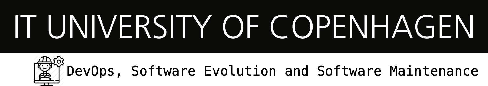

https://creativecommons.org/licenses/by-nc-sa/4.0/[image:https://img.shields.io/badge/License-CC%20BY--NC--SA%204.0-lightgrey.svg[License:
CC BY-NC-SA 4.0]]

== DevOps, Software Evolution and Software Maintenance

=== Content

This page contains information on the schedule, material, exam, etc. for the elective "DevOps, Software Evolution and Software Maintenance Content" at IT University of Copenhagen, spring 2022 (link:https://learnit.itu.dk/local/coursebase/view.php?ciid=907[BSc course description on LearnIT] and link:https://learnit.itu.dk/local/coursebase/view.php?ciid=909[MSc course description on LearnIT]).

=== Schedule

Sessions (lectures combined with exercises) are on Tuesdays from 10:00
to 14:00 first in Auditorium 2 (0A35) and then in rooms 4A14/4A16.

*OBS*: We expect you to be present during the entire time, not only the first two hours.

.Course schedule *Note*: While times are locked, the topics are subject to change.
[width="100%",cols="4%,4%,4%,3%,4%,30%,17%,30%",options="header",]
|=======================================================================
|# |Date |Time |Lecturer |Preparation |Topic |Exercises |Project Work
// w5
|1
|1/2
|10:00 - 14:00
|Helge
|link:https://github.com/itu-devops/lecture_notes/blob/master/sessions/session_01/README_PREP.md[Prep. material]
|link:https://github.com/itu-devops/lecture_notes/blob/master/sessions/session_01/Session%201.ipynb[Project start, forming groups, SSH, SCP, and Bash]
|
|link:https://github.com/itu-devops/lecture_notes/blob/master/sessions/session_01/README_TASKS.md[Refactor _ITU-MiniTwit_ to work on modern system]
// w6
|2
|8/2
|10:00 - 14:00
|Helge
|link:https://github.com/itu-devops/lecture_notes/blob/master/sessions/session_02/README_PREP.md[Prep. material]
|link:https://github.com/itu-devops/lecture_notes/blob/master/sessions/session_02/Session%202.ipynb[Packaging applications, Containerization with Docker]
|link:https://github.com/itu-devops/lecture_notes/blob/master/sessions/session_02/README_EXERCISE.md[Using Docker]
|link:https://github.com/itu-devops/lecture_notes/blob/master/sessions/session_02/README_TASKS.md[Refactor _ITU-MiniTwit_ in another programming language and tech. stack]
// w7
|3
|15/2
|10:00 - 14:00
|Helge
|link:https://github.com/itu-devops/lecture_notes/blob/master/sessions/session_03/README_PREP.md[Prep. material]
|link:https://github.com/itu-devops/lecture_notes/blob/master/sessions/session_03/Session%203.ipynb[Provision of local and remote virtual machines]
|link:https://github.com/itu-devops/lecture_notes/blob/master/sessions/session_03/README_EXERCISE.md[Using Vagrant, VirtualBox, and DigitalOcean]
|link:https://github.com/itu-devops/lecture_notes/blob/master/sessions/session_03/README_TASKS.md[Continue refactoring, introduction of DB abstraction layer, and deployment of your _ITU-MiniTwit_ to a remote server.]
// w8
|4
|22/2
|10:00 - 14:00
|Alexander (Bird&Bird), Helge
|link:https://github.com/itu-devops/lecture_notes/blob/master/sessions/session_04/README_PREP.md[Prep. material]
|link:https://github.com/itu-devops/lecture_notes/blob/master/sessions/session_04/Session%204.ipynb[Continuous Integration (CI), Continuous Delivery (CD), and Continuous Deployment, **@11:00 Guest lecture** on Software Licensing]
|link:https://github.com/itu-devops/lecture_notes/blob/master/sessions/session_04/README_EXERCISE.md[Using Travis CI (*Simulator test*)]
|link:https://github.com/itu-devops/lecture_notes/blob/master/sessions/session_04/README_TASKS.md[Setup CI & CD for reproducible builds, tests, delivery, and deployment]
// w9
|5
|1/3
|10:00 - 14:00
|Helge
|link:https://github.com/itu-devops/lecture_notes/blob/master/sessions/session_05/README_PREP.md[Prep. material]
|link:https://github.com/itu-devops/lecture_notes/blob/master/sessions/session_05/Session%205.ipynb[What is DevOps]
// , and techniques for division of subsystems
|
|link:https://github.com/itu-devops/lecture_notes/blob/master/sessions/session_05/README_TASKS.md[Cleaning and polishing of your _ITU-MiniTwit_ and entering maintenance (*Simulator starts*)]
// refactoring for clean subsystem interfaces
// Simulator starts for sure

// w10
|6
|8/3
|10:00 - 14:00
|Helge
|link:https://github.com/itu-devops/lecture_notes/blob/master/sessions/session_06/README_PREP.md[Prep. material]
|link:https://github.com/itu-devops/lecture_notes/blob/master/sessions/session_06/Session%206.ipynb[Monitoring]
|link:https://github.com/itu-devops/lecture_notes/blob/master/sessions/session_06/README_EXERCISE.md[Using Prometheus and Grafana]
|link:https://github.com/itu-devops/lecture_notes/blob/master/sessions/session_06/README_TASKS.md[Add monitoring to your _ITU-MiniTwit_]
// w11
|7
|15/3
|10:00 - 14:00
|Helge
|link:https://github.com/itu-devops/lecture_notes/blob/master/sessions/session_07/README_PREP.md[Prep. material]
|link:https://github.com/itu-devops/lecture_notes/blob/master/sessions/session_06/Session%2007.ipynb[Software Quality, Maintainability & Technical Debt]
|link:https://github.com/itu-devops/lecture_notes/blob/master/sessions/session_07/README_EXERCISE.md[Add and understand SonarQube Quality Model]
|link:https://github.com/itu-devops/lecture_notes/blob/master/sessions/session_07/README_TASKS.md[Enhancing CI/CD setup with static code analysis]
// w12
|8
|22/3
|10:00 - 14:00
|Mircea
|link:https://github.com/itu-devops/lecture_notes/blob/master/sessions/session_08/README_PREP.md[Prep. material]
|link:https://github.com/itu-devops/lecture_notes/blob/master/sessions/session_08/Session08-Logging.ipynb[Logging, and Log Analysis. Service-level agreements. Guest lecture on Software Licensing)]
|link:https://github.com/itu-devops/lecture_notes/blob/master/sessions/session_08/README_EXERCISE.md[A Basic EFK Stack]
|link:https://github.com/itu-devops/lecture_notes/blob/master/sessions/session_08/README_TASKS.md[Add logging to your _ITU-MiniTwit_ and create a set of SLAs for it]
// w13
|9
|29/3
|10:00 - 14:00
|Mircea
|link:https://github.com/itu-devops/lecture_notes/blob/master/sessions/session_09/README_PREP.md[Prep. material]
|link:https://github.com/itu-devops/lecture_notes/blob/master/sessions/session_09/Session09-Scaling.ipynb[Deployment strategies, scalability, load balancing.]
|link:https://github.com/itu-devops/lecture_notes/blob/master/sessions/session_09/README_EXERCISE.md[A Basic Swarm]
|link:https://github.com/itu-devops/lecture_notes/blob/master/sessions/session_09/README_TASKS.md[Isolate components into services/containers/VMs]
// w14
|10
|5/4
|10:00 - 14:00
|Mircea
|
|Workshop
|
|Continue isolation of components into services/containers/VMs and Fix reported problems
// w15
|–
|12/4
|-
|-
|-
|Easter Break
|-
| Operations & maintenance still reacting on issue reports and fixing of errors :)
// w16
|11
|19/4
|10:00 - 14:00
|Mircea
|
|link:https://github.com/itu-devops/lecture_notes/blob/master/sessions/session_11/Security.ipynb[Security of web-facing applications]
|link:https://github.com/itu-devops/lecture_notes/blob/master/sessions/session_11/README_EXERCISE.md[A Basic Pen-Test with Metasploit]
|link:https://github.com/itu-devops/lecture_notes/blob/master/sessions/session_11/README_TASKS.md[Security Assessment & Pen Testing]
// w17
|12
|26/4
|10:00 - 14:00
|Mircea
|
|link:https://github.com/itu-devops/lecture_notes/blob/master/sessions/session_12/IaC.pdf[Infrastructure as Code]
|link:https://github.com/itu-devops/lecture_notes/blob/master/sessions/session_12/README_EXERCISE.md[MiniTwit Infrastructure as Code]
|Encode your infrastructure setup
// w18
|13
|3/5
|10:00 - 14:00
|Mircea & Helge
|
|link:https://github.com/itu-devops/lecture_notes/blob/master/sessions/session_13/Architectural_Viewpoints.pdf[Documentation of Systems and Projects]
|
|*Simulator stops*. Write report.
// w19
|14
|10/5
|10:00 - 14:00
|
|
|
|
|Write report.
|=======================================================================

* Exam submission: Latest *19/5/2021 14:00*
* Exam dates: 21/6/2021 to 24/6/2021

=== TA Supervision

Currently, we do not have any TAs for this course.
Mircea and Helge will provide some supervision during the exercise sessoins.
In case you know of some "older" students that are experienced in the courses topic and that might be interested in TAing, please let us know.

=== Dashboards
////

==== Simulator Status Dashboard

* link:http://138.68.93.2/status.html[Status and simulator API errors per
group]
////

==== Activity Dashboard

* link:http://159.89.26.109/commit_activity_daily.svg[Daily commit activity
per group]
* link:http://159.89.26.109/commit_activity_weekly.svg[Weekly commit
activity per group]
* link:http://159.89.26.109/release_activity_weekly.svg[Weekly release
activity per group]

=== Recordings

This is not a distance course.
This term, we will not record the lectures.
You will have access to all written lecture material through this repository though.

=== Recommendation

All examples in class target link:https://pop.system76.com/[Pop!_OS 21.10].
Essentially, this is a link:http://releases.ubuntu.com/21.10/[Ubuntu 21.10 (Impish Indri)] Linux distribution.
There are many more such Ubuntu derivates, choose one of your liking: link:https://linuxmint.com/[Linux Mint], link:https://elementary.io/[Elementary OS], link:https://neon.kde.org/[KDE Neon], etc.

Since all sessions contain hands-on exercises, we recommend that you have such a Linux version installed on a computer.
(In case you decide to run another operating system, we cannot provide too much support for these during class.) The recommended setup is to have such a Linux installed natively on your machine.

Find installation instructions link:https://github.com/itu-devops/lecture_notes/blob/master/sessions/session_00/README.adoc[session_00/README.adoc].

Note, we do not have any experiences with the new M1-based Macs.
Neither do we have access to one of these.
Consequently, likely many of the technologies that we demonstrate will have issues on these computers and we won't be able to support you much.

=== Team

* *Teachers*: Helge, Mircea

=== Communication

Outside teaching sessions you can communicate with each other, and with the teachers via the link:https://teams.microsoft.com/l/channel/19%3at2eMODhCLxCUfaecj1m3xtnOsq787tnYXq02rV8qwws1%40thread.tacv2/General?groupId=2c09f960-9e5a-4ca9-a10b-5297d2b6a724&tenantId=bea229b6-7a08-4086-b44c-71f57f716bdb[the course's Teams channel].

=== Groups

==== BSc

  * Group a _Group A_ `aleso`, `jkof`, `lukb`, `mfau`, `sals`
  * Group c _DevOpps_ `osbr`, `jlhj`, `hjel`, `anpf`, `chkg`
  * Group f _PayRespect_ `momj`, `rhen`, `seho`, `jacj`, `emio`
  * Group g _Call Of Duty BlackOps_ `lakl`, `frot`, `adbe`, `cafm`, `anlf`
  * Group h _Continuous disintegration_ `smdi`, `luvu`, `ahto`, `lann`, `siam`
  * Group j _Root_ `milb`, `deyi`, `deni`, `antni`, `alja`
  * Group l _iBois_ `jacmo`, `askw`, `cger`, `ladr`, `tovs`, `alwe`
  * Group o _TBD_ `kong`, `clyt`, `eyey`, `csbe`
  * Group r _Rhododevdron_ `adbo`, `albn`, `aljb`, `losm`, `thwr`

==== MSc

  * Group b _Group Bee_ `sarw`, `fadd`, `dibo`, `vise`, `lucn`
  * Group d _DevelOps_ `boer`, `tesp`, `asno`, `calm`, `jtth`
  * Group e _ASPirin_ `npal`, `osha`, `jubr`, `oeje`, `jsow`
  * Group i _A-team_ `agbe`, `crie`, `dant`, `jone`, `harp`
  * Group k _DevUps_ `enbe`, `muki`, `hoch`, `dawo`, `krif`
  * Group m _DeadlyDevops_ `jrus`, `szyg`, `alih`, `lfor`, `npan`
  * Group n _DevØps_ `erav`, `hbel`, `apal`, `gimu`, `toap`

==== Ungrouped yet

  * `antbr`, `ddel`, `fbah`, `hahr`, `hrto`, `leku`, `slaj`, `vson`

 
== Exam Schedule

////
.Course schedule *Note*: While times are locked, the topics are subject to change.
[width="100%",cols="4%,4%,4%,3%,4%,30%,17%",options="header",]
|=======================================================================
|Day |Time Slot |Group |Group Name |Degree |#Group Members |Duration

|
|
|
|
|
|
|
|=======================================================================

More details about the exam structure can be found here: link:https://github.com/itu-devops/lecture_notes/blob/master/exam_details.md[exam_details.md]
////

===== Attributions

Organization icon made by https://www.flaticon.com/authors/freepik[Freepik] from https://www.flaticon.com[www.flaticon.com]
