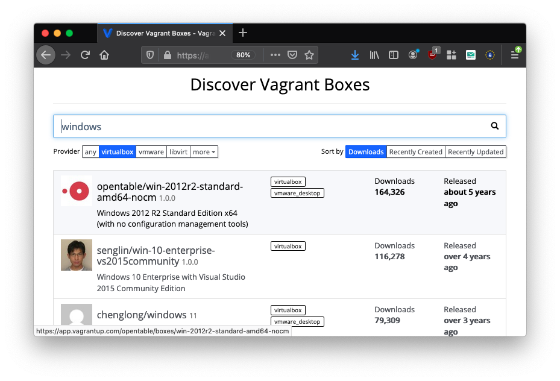

# Preparation Material for Session 03

Install Docker, Docker Compose, VirtualBox, and Vagrant on your computer.


### Docker

Install Docker as for example like this:

```bash
sudo apt update
sudo apt install apt-transport-https ca-certificates curl software-properties-common
curl -fsSL https://download.docker.com/linux/ubuntu/gpg | sudo apt-key add -
sudo add-apt-repository "deb [arch=amd64] https://download.docker.com/linux/ubuntu focal stable"
sudo apt update
apt-cache policy docker-ce
sudo apt install docker-ce
sudo systemctl status docker
sudo usermod -aG docker ${USER}
su - ${USER}
id -nG
```

The above is based on: https://www.digitalocean.com/community/tutorials/how-to-install-and-use-docker-on-ubuntu-20-04


### Docker Compose

```bash
sudo apt install docker-compose
```


### Vagrant & VirtualBox


Install Virtualbox:

```bash
sudo apt-get install virtualbox virtualbox-ext-pack
```

Since the packaged Vagrant in the linked repositories is in a bit buggy version we install it directly from the package provided by the tool vendor:

```bash
wget -c https://releases.hashicorp.com/vagrant/2.2.14/vagrant_2.2.14_x86_64.deb
sudo dpkg -i vagrant_2.2.14_x86_64.deb
```

After installing Vagrant, we need to install a Vagrant plugin that we will need later:

```bash
vagrant plugin install vagrant-digitalocean
```


<!--
sudo apt-get install --reinstall virtualbox-dkms
-->

In case you are running MacOS or Windows you might find helpful [installation instructions for your host operating system in the linked guide](https://www.itu.dk/people/ropf/blog/vagrant_install.html). Note, Vagrant cannot be run in a VirtualboxVM.


Save the following into a file called `Vagrantfile` in your current directory:

```ruby
# -*- mode: ruby -*-
# vi: set ft=ruby :

Vagrant.configure("2") do |config|

  config.vm.box = "generic/ubuntu1804"
  
  config.vm.provider "virtualbox" do |vb|
    # Customize the amount of memory on the VM:
    vb.memory = "1024"
  end
end
```

Now, try to run from your current directory (the one in which you saved the `Vagrantfile`):

```bash
vagrant up
```

The command downloads the OS image `generic/ubuntu1804` and brings up a virtual machine on your computer (with Virtualbox as backend).
It will take some time since the corresponding OS image has to be downloaded first. That image will be cached on your disk, i.e., following VM instantiations of the same image will be faster.
Observe that no error message is displayed. If so, and in case you cannot find a solution for it, we will look at it in class.


In case you did not receive any error message, for now, you can run:

```bash
vagrant destroy
```


### Intro to VMs with Vagrant

  > Vagrant is a tool for building and managing virtual machine environments in a single workflow. With an easy-to-use workflow and focus on automation, Vagrant lowers development environment setup time, increases production parity, and makes the "works on my machine" excuse a relic of the past.
  >
  > Vagrant provides easy to configure, reproducible, and portable work environments built on top of industry-standard technology and controlled by a single consistent workflow to help maximize the productivity and flexibility of you and your team.
  >
  > https://www.vagrantup.com


In case you are in doubt about anything in the following quick intro, check the [brief and really good documentation](https://www.vagrantup.com/docs/).

#### Initialize & Start a VM

You can start your setup by creating a `Vagrantfile`. The argument to `vagrant init` is the name of the *box*. That is, 

```bash
$ mkdir vm
$ cd vm
$ vagrant init generic/ubuntu1804
$ vagrant up
```

  > After running the above commands, you will have a fully functional VM in VirtualBox running Ubuntu 18.04 LTS 64-bit. You can SSH into this machine with `vagrant ssh`, and when you are done playing around, you can terminate the virtual machine with `vagrant destroy`.
  

#### Accessing a VM

You log onto a VM with SSH as in the following.

```bash
$ vagrant ssh
```

You can leave the guest VM with:

```bash
$ vagrant@vagrant: exit
```

#### Teardown

A running VM can be ... 

  * put to sleep 
  
  ```bash
  $ vagrant suspend
  ```
  
  * turned off 
  
  ```bash
  $ vagrant halt
  ``` 

  * removed completely 
  
  ```bash
  $ vagrant destroy
  ```

#### State of VMs

The following command will display a list of all VMs and their respective states, i.e., `saved`, `poweroff`, `active`, etc.

```bash
$ vagrant global-status
```

#### VMs with other Operating Systems

That is, you can quickly setup development environments for many operating systems. For example, in the following the initialization and use of a FreeBSD and Windows VM.

```bash
$ mkdir vm_freebsd
$ cd vm_freebsd
$ vagrant init freebsd/FreeBSD-11.0-STABLE
$ vagrant up
```

```bash
$ mkdir vm_win
$ cd vm
$ vagrant init senglin/win-10-enterprise-vs2015community
$ vagrant up
```

You can find a catalogue of available boxes at https://app.vagrantup.com/boxes/search




### Vagrant for **local** development setup

At last, apply `vagrant` for a usual scenario: reproduction of development environments.

The branch [`VMify_local`](https://github.com/itu-devops/flask-minitwit-mongodb/tree/VMify_local) of repository https://github.com/itu-devops/flask-minitwit-mongodb contains an _ITU-MiniTwit_ application similar to the one you took over last week. It was refactored to use a MongoDB database instead of an SQLite3 database.

The application is a two-layered application with a frontend server (called `webserver`) and a database server (called `dbserver`).
With the VM setup from the [`VMify_local`](https://github.com/itu-devops/flask-minitwit-mongodb/tree/VMify_local) branch, you have a complete running setup of the entire application that you can recreate on you computer, e.g., for local development.

To do so, clone the repository, switch to the right branch, check and try to develop a feeling for the contents of the [`Vagrantfile`](https://github.com/itu-devops/flask-minitwit-mongodb/blob/VMify_local/Vagrantfile), and start-up the VMs.

```bash
$ git clone https://github.com/itu-devops/flask-minitwit-mongodb.github
$ cd flask-minitwit-mongodb
$ git checkout VMify_local
$ vagrant up
Bringing machine 'dbserver' up with 'virtualbox' provider...
Bringing machine 'webserver' up with 'virtualbox' provider...
...
```

If everything starts error-free, you will find the running _ITU-MiniTwit_ at http://192.168.20.3:5000. With `vagrant ssh webserver` you can access the machine with the frontend code.

