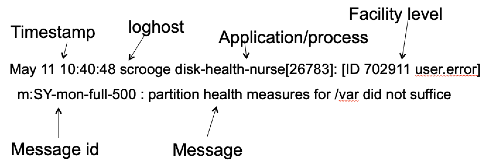
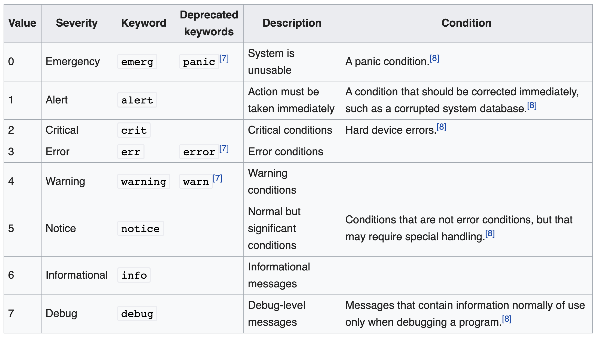
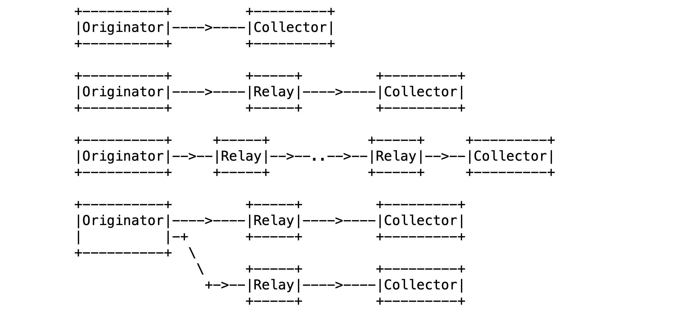
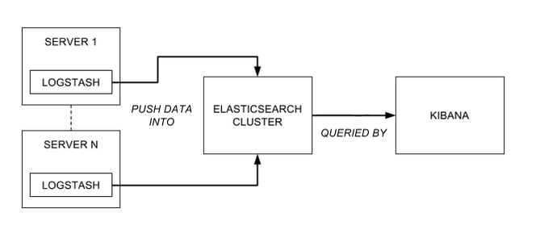
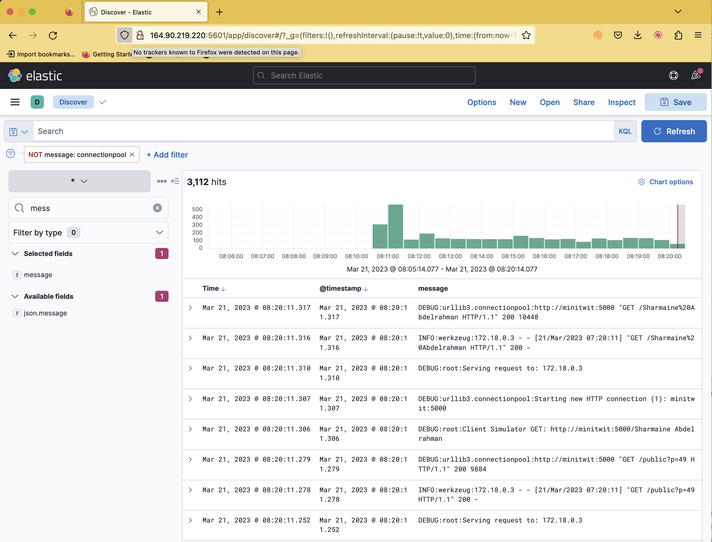
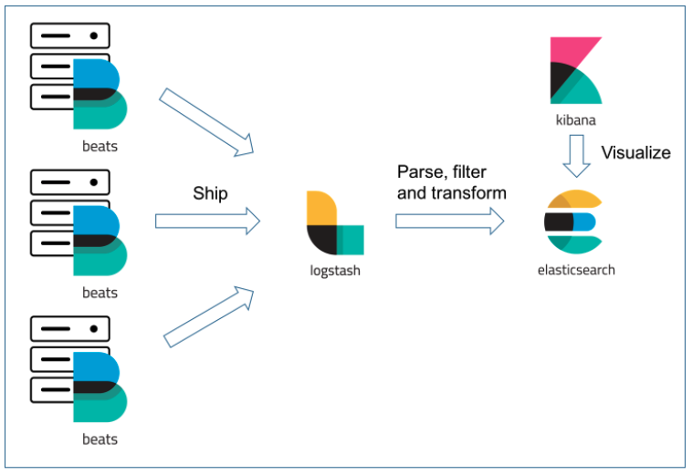
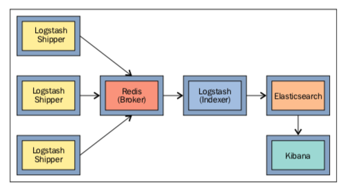
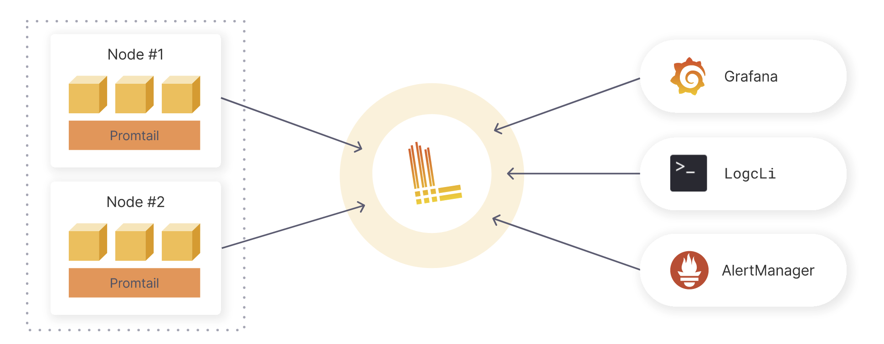

# Logging

Mircea Lungu (`mlun@itu.dk`)  

[IT University of Copenhagen, Denmark](https://www.itu.dk)

Lecture notes for: DevOps, Software Evolution and Software Maintenance 

([*pdf version of this doc*](./Logging.pdf))


--- 


*In the last episode...* 

- **monitoring** - a tool that allows you to detect problems.
	- What are the types of problems detectable by monitoring? 
	- Does monitoring help you understand why these problems occur? 


--- 


## From Monitoring to Logging


Monitoring does not explain *WHY* there was a problem

For the WHY there are other tools

- **Logging** (*main topic of today*) = understanding general kinds of problems 

- **Profiling** = understanding *performance* problems

- **Tracing** (*not today*) = understanding problems where the *sequence in which requests propagate* through distributed systems matter 


## What is it? 

**Logging** =  the **activity** of collecting and analyzing data generated by applications, infrastructure, and other components of a system.

**Logs** =

- **streams** of 
- **aggregated**
- **time-ordered** events
- collected from **all running processes and backing services**

In server-based environments logs are commonly written to *a **logfile*** on disk. E.g., 

     cat /var/log/auth.log

Running the above command on an Internet-facing server should be a reminder of the importance of security.


## Why do it?

There are three main reasons for logging: 

1. **Diagnosis** 

  - Why could the user not login yesterday? 
  - Why is the service slow?


2. **Understanding** 

 - How is our system being used?
 - Was our server under attack last night?


3. **Audit trails**
  - Sometimes logs are legally required (e.g. banking)
  - Sometimes they save your ass (because your DB model was not updated - but you can still recover info from the logs)


## Challenges

There are three main challenges

### Finding Relevant Data in Logs
 Logs can quickly become very large and searching information in them can become tedious and difficult

### Compatibility of Formats 
 Complex systems can generate logs in different formats 
 
 E.g. look at the following files in `/var/log`: `auth.log`, `apache2/error.log`, `nginx/access.log`. Do they use the same format?

### Storage Management 
 
 Logging can result in very large data that has to be managed.
 
###### Story: How to not be able to login to your sever anymore
The situation resulted from the following sequence of unfortunate events
- Logfile grows to multi-GB size in a few months
 - Disk becomes full
 - To the point of not even being able to ssh into bash 
 - Solution is to run a delete command  w/o even creating a terminal (e.g. `ssh user@server rm -rf /tmp`


Maybe a final conceptual challenge: what stack and architecture do you use for your logging infrastructure?

# Architectures 

## Syslog 

Protocol

* Developed in 80s
* Standardizes **formatting** and **transmission** of logs in a network ([RFC 3164 (2001)](https://tools.ietf.org/html/rfc3164) [RFC 5424 (2009)](https://tools.ietf.org/html/rfc5424))
* Popular in Linux
* General - for any system exchanging logs 


### Formatting

A syslog message is structured in a pre-defined format. Most essential elements are timestamp, application, level, and message. 



### Facility Codes

The original protocol defines many facility codes, several examples of which are below. 

0. kern  = Kernel messages
1. user = user-level messages
2. mail = mail system
3. ... [etc.](https://www.geeksforgeeks.org/what-is-syslog-server-and-its-working/)

Most of your applications will use the user facility. 


### Log Levels

Syslog predefines 8 levels of severity for logs, presented in the table below.
Other systems use only a subset of these (e.g. the `logging` package in Python).




### Architectures for Log Transmission

Syslog proposes a separation between the following roles 

  - **Originator** = sender
  - **Collector** = responsible for gathering, receiving, and storing log messages
  - **Relay** = responsible with receiving syslog messages from multiple sources, possibly aggregating them or filtering them, and then forwarding them to one or more destinations



Source: [RFC 5424 (2009)](https://tools.ietf.org/html/rfc5424)

Example of syslog configuration: 
```
cat /etc/rsyslog.conf 
```
## ELK

One of the most popular solutions at the moment. 

Acronym for

* ElasticSearch = Scalable full text search DB
* Logstash = Java-based log parser
* Kibana = Visualization tool tailored for ElasticSearch





### ElasticSearch

Distributed database which

* Provides *almost* real time full text search
* Supports **dedicated log indexes**

*Story*: That time when we evaluated the performance of [MySQL 8.0 Full Text Search](https://dev.mysql.com/doc/refman/8.0/en/fulltext-search.html) vs. ElasticSearch. And ES blows MySQL out of the water on this task. 


### Logstash

Java-based log parser which ... 

- Converts from various log line formats to JSON
- *Tails* log files and emits events when a new log message is added
- Uses a pattern parsing plugin named Grok

An example configuration for logstash when trying to run it on my mac os looks like below: 

    input {
    	file {
    		path => "/Users/mircea/local/zeeguu/web.log"
    	}
    }

    filter {
    	grok {
    		match => { "message" => "%{TIMESTAMP_ISO8601:timestamp} %{DATA:level} %{DATA:process} %{GREEDYDATA:log}" }
    	}
        date {
            match => [ "timestamp" , "dd/MMM/yyyy:HH:mm:ss Z" ]
        }
    }

    output {
    	elasticsearch {
    		hosts => "elasticsearch:9200"
    		user => "elastic"
    		password => "changeme"
    	    index => "zeeguu_web"
    	}
    }


Challenges

- **Resource hungry**
- Not easy to configure and troubleshoot


### Kibana

Visualization tool tailored for ElasticSearch
- Has its own query language: KQL




## Variations and Alternatives to ELK

There are many **variations** where one component in ELK is replaced with another or new components are introduced. 


### EFLK: Filebeat for shipping logs

Filebeat = *Log Shipper*

- Addresses resource consumption of logstash
- Lightweight agents on different machines send logs to logstash
- Has special plugin for *docker* -- see your exercises for an example





### EFK: Dropping Logstash Alltogether

- Filebeat sends data straight to ElasticSearch 

- If you don't need to parse further the `@message` field

- In your exercises example


### FRELK: With the Redis message broker

Redis = in memory data structure that can be used as DB, cache, and message broker

Purpose: prevention of data loss. Can you explain how?




### Promtail + Loki + Grafana

Promtail = **agent that ships the contents of local logs**

Loki = **log aggregation tool developed by Grafana labs** 

- Lightweight = Only indexes meta-data
- No distributed architecture for Loki (vs. ES)




Might be relevant if you already use Grafana.


## Architectural Tactic: Log Rotation

- Set a threshold of time / size 
- After which the data in the file is truncated / stored elsewhere

Example configuration on Linux
```
cat /etc/logrotate.conf
```


# Practical Principles

There are four main practical principles

## A process should not worry about storage

Or, **don't hardcode the path to the logfile to which your process writes**.

Instead, each process should **write to its unbuffered stdout stream**.

Advantage is adaptability

* **In development**: the developer looks at the terminal

* **In deployment**: output from process is routed where needed 

* Different contexts result in different logfiles, e.g. cronjob


## A process should log only what is necessary

What's necessary for? 

- Apache
- Credit Suisse
- MiniTwit


Why? Because you **avoid ...** 

1. **duplicated information**
	* e.g., you don't need log the web server accesses; they're already logged by your web server

2. **information overload** on the reader of the logs

3. **wasted disk space**


## Logging should be done *at the proper level*

Why? 

- Allows the user to control the amount of logging (one can easily increase log level if they want to analyze more)
* Intention revealing enables the reader to make sense of the messages


Possible intention revealing classification of log levels in Python with the `logging` package: 

```python
import sys
import logging

logging.basicConfig(
        format="%(asctime)-15sZ %(levelname)s [%(module)s] %(message)s",
        datefmt="%Y-%m-%d %H:%M:%S.%f",
        level=logging.DEBUG,
        stream=sys.stdout
)

logging.debug("Got here!")
logging.info("User updated preferences.")
logging.warning("Could not retrieve any items from feed.")
logging.error("Google Translate API not answering")
logging.critical("Out of memory")
```

###### Personal Story: The Python library with very verbose logs!
I remember I was reusing this Python library that would generate a LOT of logs by default, so my own logs were drowning in their's. It is good that the logging package allows you to turn on/off logging per package.

## Logs  should be centralized

Why? Because having all the information in one place ... 

- Is **more efficient** than having to search through different files on different machines
- Enables **correlation analysis**


# Ethical & Security Aspects

## Privacy and Security

* Do not log secrets in plaintext

- Do not log user private data 
	- You might have to "GDPR-remove" them 

* Be aware of who has access to the logs

## Logging for Analytics?

You can use your own logging infra for analytics instead of relying on Google Analytics

Note: More logs => more privacy concerns


# Further Considerations

## Docker and logging

- When you are running containers if you don't collect and ship the logs, they'll disappear when you restart (or destroy) the container

- Docker - all logs on a machine can be found in `/var/lib/docker/containers/<container_id>`

- When using Docker containers - log files are lost when recreating containers


- At least one group succeeded in integrating Loki & Grafana instead of ELK in their setup

- Alternative to `docker logs `  is  [`docker attach`](https://docs.docker.com/engine/reference/commandline/attach/) 


## Logging vs. Crash Reporting
  
Similarity: often written to the same logfile

Difference: obviously not all logs are crashes

Example of a specialized tool: Sentry

## Logging every event 

- With  *sufficiently high-resolution* logging you can have a practical backup of the state of the database...
- *Binary logging* inMySql 
	- Stream of events that modify the DB
	- Can be shipped across machines
- Bitcoin = a big distributed log of all transactions?

## Visualizing multiple logfiles at once from terminal

I use this in one of my deployments

LNAV = Log File Navigator ([lnav.org](https://lnav.org/))

- Terminal based (as opposed to web-based)
- Can aggregate live multiple files
- Supports basic search from the command line 
- Very little resources compared with ElasticSearch / Grafana

# Lessons Learned 

Situations encountered in past iterations of this course that might be relevant also for you.

## .NET logging Instead of Logstash

> "My group ditched LogStash last year in part because it is slow, but also because .NET had a logging package that seamlessly integrated with ElasticSearch. So we basically just logged straight into ElasticSearch"
> (DevOps student from 2021)

## Are  logs being sent to ElasticSearch?

> Q: Hi, we are using Serilog, Elasticsearch and kibana in our application for logging but kibana isn't showing any data. I'm not sure where in the process it is failing and the logs aren't being passed on. I've looked at countless guides and tutorial and our  configuration matches those but still haven't been able to get to work. Has anyone had any issues? or can offer help. thanks!

A: Try to debug it step by step. Is the data in ES?

If you know the name of your index, then you can `curl localhost:9200/nameofindex/_count` and you should see the number of "documents" (logs) in your case.

if you don't know the name of your index, then try to get all of them with something like `curl localhost:9200/_cat/indices`


ah, now I see that you have two documents in each one of your indexes. every log message should be a document. you should definitely have more than 2 if your logs are being sent to ES. in fact, if you look at the name of those two indices, they're both named `.kibana*` - they are internal kibana indices; you have not succeeded in creating an index or sending any data to elastic search it seems. Probably better do the `docker logs` on the elasticsearch container to see whether you can learn something from that!


## Minimum memory requirements for ELK (E?)

- ELK - in the past one could reduce the memory allocated to it to about 700MB at the minimum


# Further reading

- [Why Grafana is Good at Metrics and Not Logs](https://grafana.com/blog/2016/01/05/logs-and-metrics-and-graphs-oh-my/)
- [Loki vs Elasticsearch - Which tool to choose for Log Analytics?](https://signoz.io/blog/loki-vs-elasticsearch/)
- [What is a Syslog server and its working?](https://www.geeksforgeeks.org/what-is-syslog-server-and-its-working/)
- ... 
