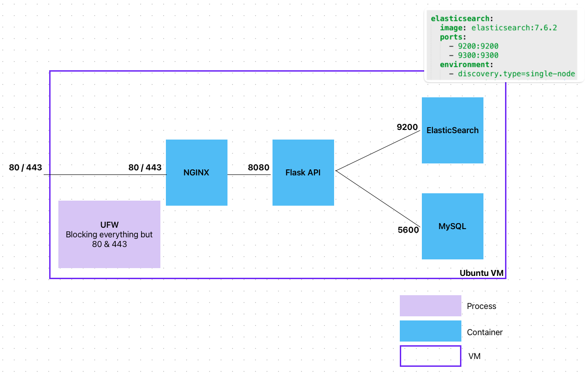
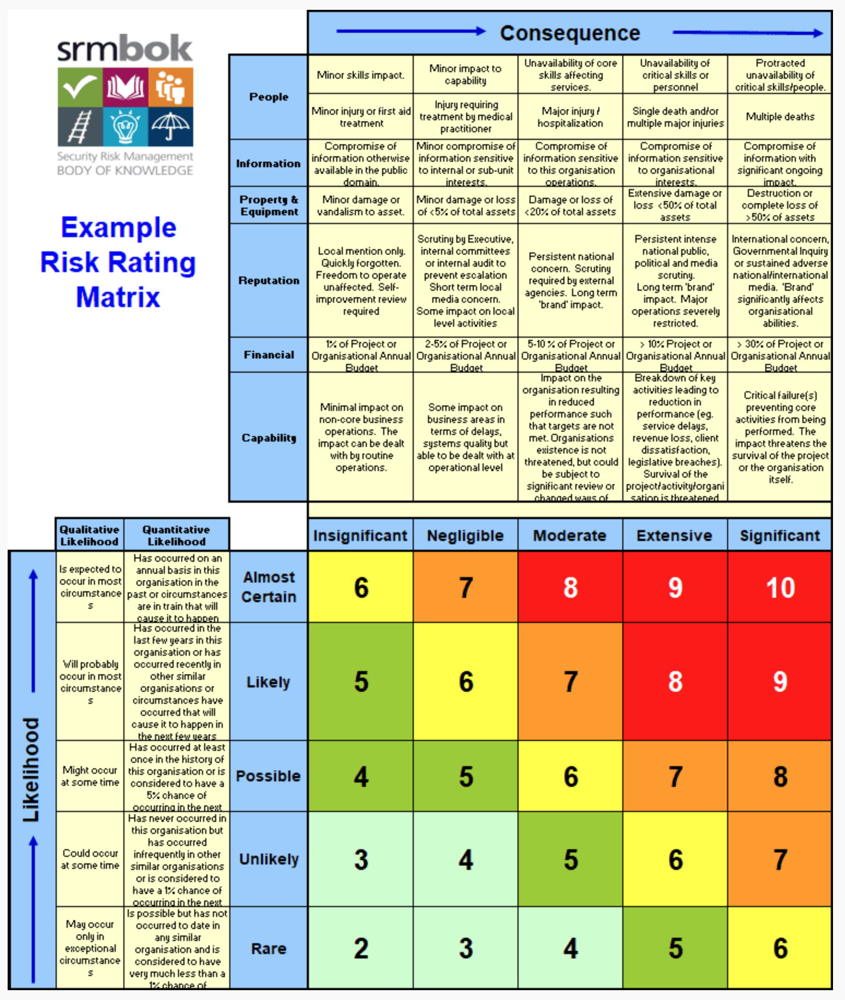
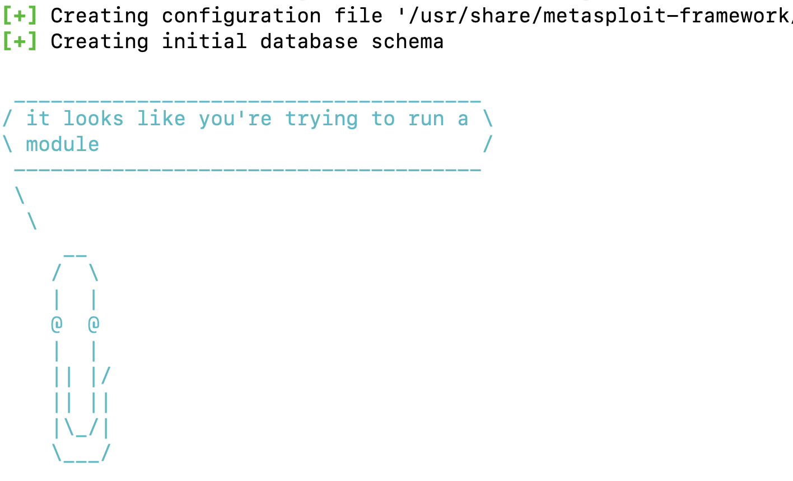

class: center, middle

## DevOps, Software Evolution and Software Maintenance

# Security

Mircea Lungu, Associate Professor, 
[IT University of Copenhagen, Denmark](https://www.itu.dk) 
`mlun@itu.dk`

---

---

## Before we Start: State of the Projects

**Logging** 
  - Did you add logging to your MiniTwit?
	  - Group J: http://46.101.210.94:5601/
	  - Group M: http://143.244.205.161:3000/d/zs1TJ1f4z/logs?orgId=1
	  - Group N: http://157.230.76.157:5601/
  - What frameworks / libraries / tools did you use? 

--

**Logging in Practice**
  - Could you catch a bug in production with the help of the scenario that we provided you? 
  - What was the bug? Did the logging help?
  - Do you see access logs? 
  - Is anybody trying to hack your system?

---
### Latest processed events

<object width="100%" data="http://104.248.134.203/chart.svg"></object>

---

## Compare the following quotes

- "Oh, sure we can implement a Facebook competitor for you" (My friend J and me)

- "I was upgraded from engineer to Site Reliability Engineer. It is one of the most important roles in our company". (My friend K)

##### Which one is more professional?
---

### Site Reliability Engineer

"The SRE role of today **combines the skills of the developer responsible for writing applications and the skills that operations engineers use to deploy those applications**. 

The SRE moves an application from proof of concept, to quality control, and then to deployment – **automating that entire process** and giving it consistency.

--

By **continuing to run security experiments**, we can evaluate and improve such vulnerabilities proactively in the ecosystem before they become crisis situations." ([Through the looking glass: Security and the SRE](https://opensource.com/article/18/3/through-looking-glass-security-sre))

--

Question: Is it the same or not? 

---

## Professional System = A Dependable System

  

Sommerville defines **dependability** as: 
- **availability**  -- probability that a system is operational at a given time -- Uptime / (Uptime + Downtime), e.g. "5 nines"

- **reliability** -- probability of correct functioning  for some given time  -- MTBF = mean time between failures 

- **safety**  -- ability to operate w/o catastrophic failure

- **security** <-- *today's focus*!!!!

---

# Information Wants to be Free...

"Information wants to be free

Information also wants to be expensive.

That tension will not go away

" 

 
A question from the book: "Can you map the flow of information in the world?" + [One possible answer](https://mircealungu.com/notes/Mapping-the-Information-Economy.html) 

---

# Security

... the protection of computer systems and networks from the theft of or damage to their hardware, software, or  data, as well as from the disruption or misdirection of the services they provide. [1]

[1] https://commons.erau.edu/cgi/viewcontent.cgi?article=1476&context=jdfsl 

---

# State of the Security

- **The most common way to discover security failures?**
  - when a security incident happens 

- **Average time until people found out they were hacked?**
  - half a year! [1]
  - By this time, it is often too late, and damage has been done. 
  - *Story*: Russian vs. Brazilian hackers.

[1] 2017 Cost of Data Breach Study by IBM -  https://www.ibm.com/downloads/cas/ZYKLN2E3

  
---

## That time when I migrated a web app to a new server

- NGINX - as reverse proxy
- UFW as more *uncomplicated* firewall than iptables
	- in practice, ufw is an abstraction layer above iptables

---

## The Next Day: Backup of ElasticSearch DB is very small... 

### Looking in the DB Shows a Single Document!

---

## What went wrong ?

- Docker circumvents the UFW firewall and alters iptables directly 

- Mapping the ports with `-p 9200:9200` maps the port to the host but also opens it to the world! ([bug report from '19](https://github.com/docker/for-linux/issues/690))) 
	> Publishing ports produce a firewall rule that binds a container port to a port on the Docker host, ensuring the ports are accessible to any client that can communicate with the host.
- Solution: [configure Docker to not do this]([descriptive article](https://www.techrepublic.com/article/how-to-fix-the-docker-and-ufw-security-flaw/)

---

# What to do? 
  

**We need a proactive and systematic approach**
  1. understanding threats
  1. assessing risk
  1. testing security
  1. detect breaches

--

**As Devs coming to DevOps...** we must become good with
   - security
   - system administration
   - networking

---

# 1. Understanding Threats

### What is a threat? 

A threat is defined by a triplet:

1. Intent (we can guess)

1. Capability (we can't change)
2. Opportunity <-- (this is our focus!)

---

## 1&2: Intent and Capability of Attackers

* Black Hat - bad intent, high capabilities (inspired from western movies)

* Script Kiddies - they have time on their hands and not good intentions

* White hat - ethical hackers, working with orgs to strengthen security

* Grey Hat - not malicious, usually notify you that they hacked you

---

## 3: Opportunities

Framework for Discovering Opportunities for Web Applications: OWASP

- Open Web Application Security Project
- Online Community
- Maintains lists of vulnerabilityes for web applications

- **OWASP Top 10** Include:
  1. Broken Access Control
  3. Injection (XSS, SQL, etc.)
  7. Identification and Authenticaion Failures
  9. Insufficient Logging & Monitoring (!!!)

---

### OWASP Detail: Insufficient Logging and Monitoring

Issue included in the Top 10 **based on an industry survey**

Strategy for determining if you have **sufficient monitoring**

- examine the logs following *penetration testing* (defined later)

- the testers’ actions should be recorded sufficiently to understand what damages they may have inflicted

Note: *applying this strategy is part of your assignment*

---

### Insufficient Logging and Monitoring: When...

- Auditable events are not logged
  - e.g. loginsfailed logins, and high-value transactions
- Warnings and errors generate no log messages
  - (or inadequate, or unclear)
- You're not looking at the logs!
- The application is unable to detect, escalate, or alert for active attacks in real time or near real time.

Source: [OWASP Top 10: Insufficient Logging and Monitoring](https://owasp.org/www-project-top-ten/OWASP_Top_Ten_2017/Top_10-2017_A10-Insufficient_Logging%252526Monitoring)

Logging Cheatsheet from OWASP: https://cheatsheetseries.owasp.org/cheatsheets/Logging_Cheat_Sheet.html

---

# 2. Assessing risk

### Risk Matrices

**Likelihood** e.g., Certain, Likely, Possible, Unlikely, Rare

**Severity**. e.g., Insignificant, Negligible, Marginal, Critical, Catastrophic

**Risk** = f(Likelihood, Severity)

---

### Example: Levels of Severity 

cf. Security Risk Management Body of Knowledge

---

### Example: Degrees of Likelihood

cf. Security Risk Management Body of Knowledge

---

# 3. Testing

Penetration Testing (a.k.a. pen-testing)
- simulate attacks on your system
- helps you understand what an attacker can do

> "blue teams always need **red teams** to test them against each other"

---

### Automating Pen Testing

- Tools exist that can automate the process
- You provide a target IP and they scan it for vulnerabilities

- Kali Linux
  - security focused distro
  - contains a very large set of tools (https://tools.kali.org/tools-listing)
  - can be installed in meta-packages (https://www.kali.org/news/kali-linux-metapackages/)
	    - top10
	    - web
	    - wireless
	    - etc.

---

### Tool: Metasploit

- ruby-based framework for vulnerability scanning
- very popular
- large number of plugings

More: https://github.com/rapid7/metasploit-framework

A lot: https://books.google.dk/books?id=EOlODwAAQBAJ

---

### Tool: WMAP Plugin for Metasploit

- feature-rich web application vulnerability scanner 
- originally created from a tool named SQLMap
- integrated with Metasploit 
- see exercises for usage

[1] https://www.offensive-security.com/metasploit-unleashed/wmap-web-scanner/

---

### More Pen-Testing Tools

Inside Kali Linux
- [skipfish](https://www.systutorials.com/docs/linux/man/1-skipfish/)
- [nmap](https://nmap.org/book/man-port-scanning-basics.html)

Desktop Apps
- OWASP ZAP 
  - free, open-source penetration testing tool 
  - maintained under the umbrella of the OWASP 
  - [getting started](https://www.zaproxy.org/getting-started/), [docs](https://www.zaproxy.org/docs/api/#introduction)
- The tools in the [list of OWASP vulnerability scanning tools](https://owasp.org/www-community/Vulnerability_Scanning_Tools)

Online Services 
- Detectify (https://detectify.com/)
 - quite nice
 - requires an account
 - require you to prove that you own the website
- Mozilla Observatory (https://observatory.mozilla.org/)
- shodan.io

---

# 4. Detection

Is hard.

Warning signs that you might have an intruder
 - abnormal network traffic (important to monitor!)
 - unusual resource usage (ditto)
 - you can't access your server
 - your server IP has been blacklisted
 
---

## Detection - Approach

- Develop baseline for normal

- Stop intruders from taking information out 
  - firewall
  - traffic filtering
  - white/black listing
  
- Auditing, compliance testing

 
---

# Practical Steps to Improve Security

---

## 1. Evaluate Dependencies

- Keep dependencies up to date

- Scan dependencies for security breaches
  - source code and container images too
  - add security checks as part of your CI

**Principle**

  > "If its part of your app, it should be part of your security process"

##### Case Study
[Postmortem for Malicious eslint Packages Published on July 12th, 2018](https://eslint.org/blog/2018/07/postmortem-for-malicious-package-publishes)

---

## 2. Never Trust User Input

> Principle: "All input is bad until proven otherwise

- Validate the input before using it
  - in the webpages
  - in the API
- Use parameterized DB queries (or whatever framework help you can)

--

---

## 3. Protect  Servers

- Keep software on servers up to date
	- - e.g. [`apt-get install unattended-upgrades`](https://wiki.debian.org/UnattendedUpgrades)

- System hardening
	- analyzes the system from within
	- treats the system as white box as opposed to blackbox
	- e.g. tool `sudo lynis audit system`

---

## 4. Protect Secrets

- Don’t commit credentials and other secrets (like keys and certs) into a VCS repository

- Use 2FA for secret repositories

- Consider using dedicated tools and vaults for secrets

##### Case Study
[The Uber Breach](https://www.bloomberg.com/news/articles/2017-11-21/uber-concealed-cyberattack-that-exposed-57-million-people-s-data) - started accessing a private GitHub repo, where keys were found for an AWS account, etc.

---

## 5. Hack Yourself

- Create a red team to pen test

- Stress the app infrastructure

*Note: part of the assignment*

---

## 6. Protect your CI/CD tools 

- CI pipeline is part of your infrastructure

##### Case Study

Multiple US government agencies [hacked due to misconfiguration of their TeamCity CI tool](https://cd.foundation/blog/2021/01/07/could-ci-cd-tool-teamcity-really-have-been-exploited-to-hack-the-us/_)

---

## 7. Automatic Backups

- Data is probably your most precious asset; don't lose it

- Test your full recovery process! 

	- A backup is not useful unless you can use it to actually perform the backup

---

## 8. Log Everything 

- Your key to being able to detect attacks 
- See previous lecture for details

---

# What Next?

- Exercise: [Pen testing with Metasploit / wmap](https://github.com/itu-devops/lecture_notes/blob/master/sessions/session_09/README_EXERCISE.md)

- Practical: 
	- [Own security assessment](https://github.com/itu-devops/lecture_notes/blob/master/sessions/session_09/README_TASKS.md#1-perform-a-security-assessment)
	- [White-hat pen-test another group](https://github.com/itu-devops/lecture_notes/blob/master/sessions/session_09/README_TASKS.md#2-white-hat-attack-the-next-team)
