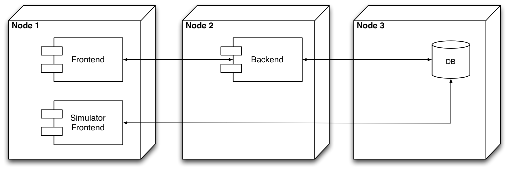
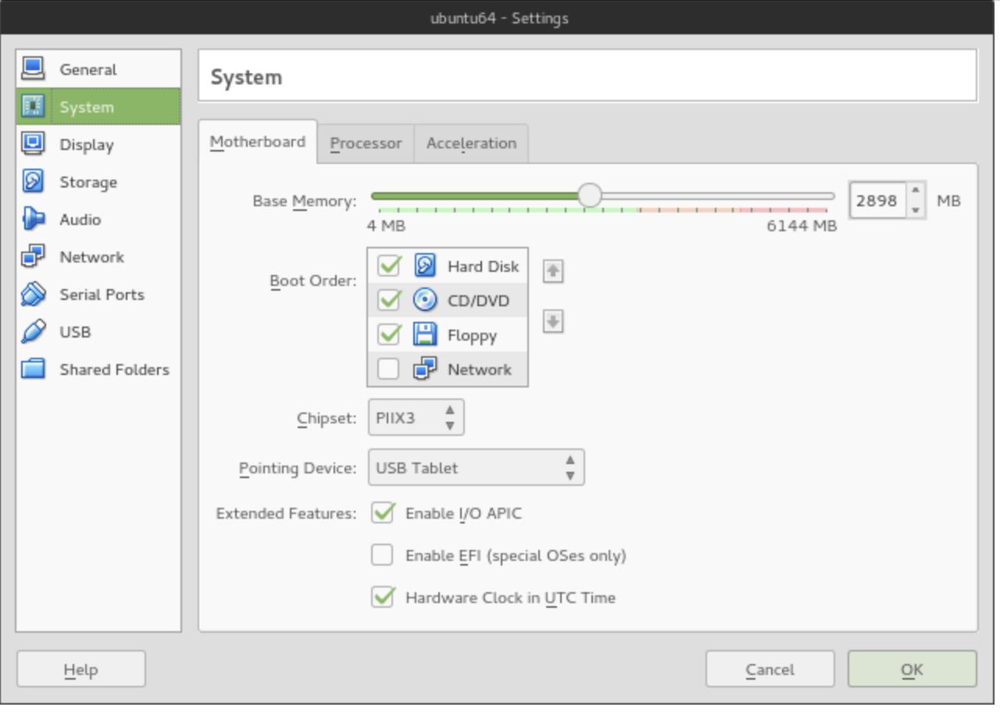
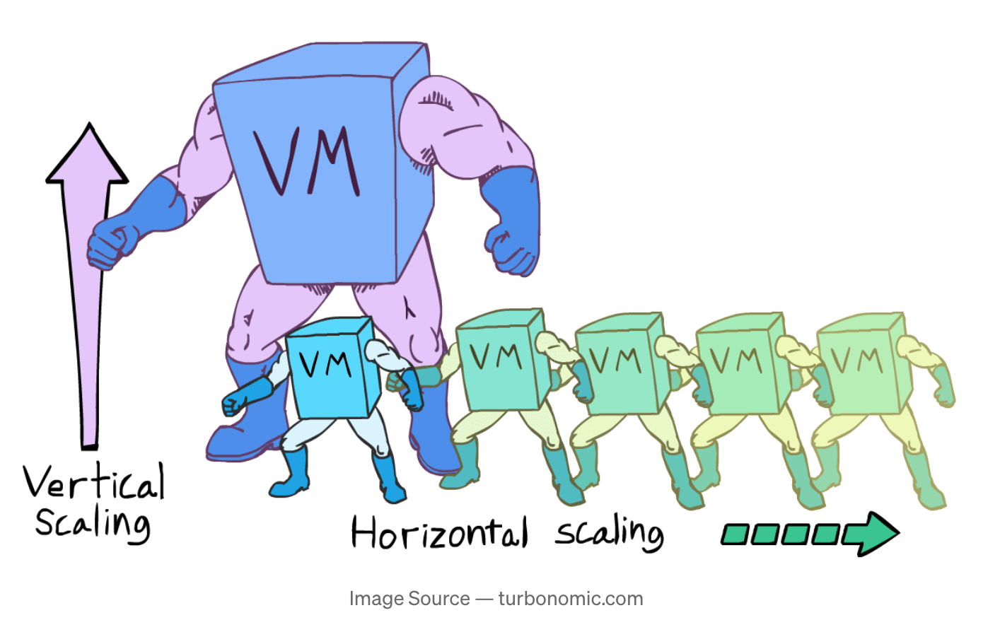
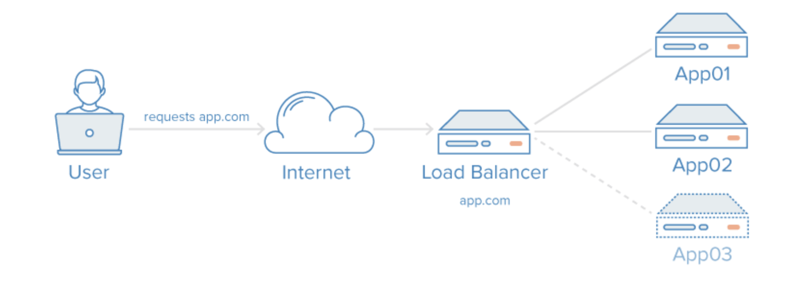
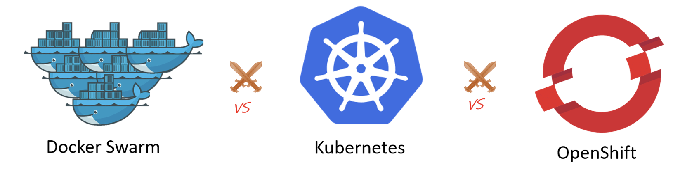
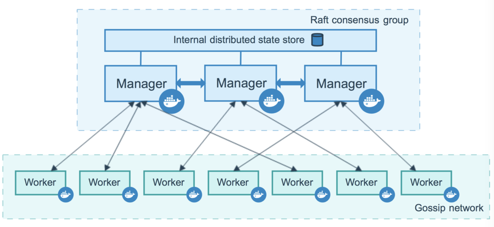
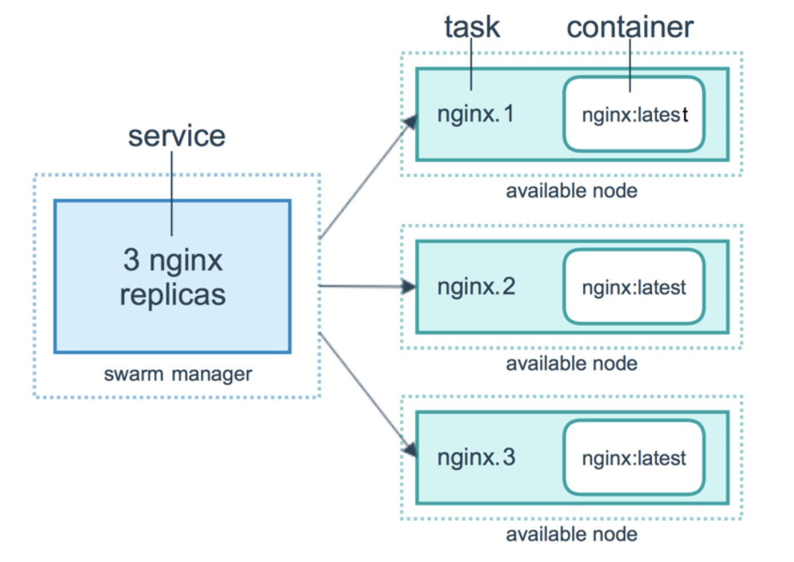
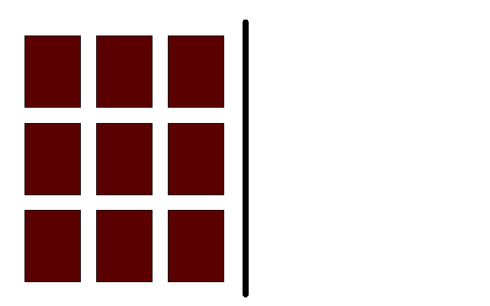

# Availability

Mircea Lungu, Associate Professor,<br>
[IT University of Copenhagen, Denmark](https://www.itu.dk)<br>
`mlun@itu.dk`


# Introduction

## The story of healthcare.gov

Highly anticipated launch (e.g. the [healthcare.gov](https://www.cbsnews.com/news/healthcaregov-plagued-by-crashes-on-1st-day/) story) that resulted in the system experiencing a performance degradation 


> Instead of new choices, the website told him to wait. Attempts to log on with a CBS News producer's iPad failed too. 
> After more than an hour, he gave up.
> "I was excited to get on, and I can't, so yeah I'm disappointed," Matt Warren said.
> Matt Warren said he will try again Wednesday. There are about six million uninsured residents in Texas. It's estimated half of them could be covered by the Affordable Care Act.
https://www.cbsnews.com/news/healthcaregov-plagued-by-crashes-on-1st-day/


How do we technically describe what happened? The availability of the system was low. 

## Availability 

### What is availability? 

**Availability** is 
- a quality attribute... 
- that is expressed as the **proportion of time that a system or service is operational** and accessible for use. 

e.g. 99.999% uptime, we call it "number of nines"

**Relevant** especially in the context of 
- online services and apps
- banks
- healthcare
- cloud-based applications
- mission-critical systems

High availability means that users can access the system without significant interruptions or downtime.

### How do systems fail to achieve availability? 


#### Individual Components Fail

This is probably the architecture that many of your systems have at the moment. 


We say that such an architecture has a **single point of failure** = *a part of the system failing will stop the entire system from working*. 


###### What if we use multiple machines in the above scenario? 

This scenario has different containers run on different machines (V or not V ;). 



--

The scenario is not better from an availability POV. In fact, it might even be worse: we have even more **single points of failure** because each hardware node is one such possible point of failure. 

---


#### Individual Components Are Overwhelmed


> > Your user authentication system is slow, and your application becomes really popular with many users trying to create accounts at the same time. **The server’s CPU becomes a bottleneck** hashing algorithms used by the application is computationally intensive, causing login delays, and users going away from the system. 


What's the problem in this situation? 


##### Congestion

= **reduced quality of service that occurs when a network node or link is attempting to handle more data than it can**

Possible Reasons for congestion 
- Seasonal spikes in demand
	- Highly anticipated launches (healthcare.gov)
	- Traffic surges (e.g. [The Slashdot effect](https://en.wikipedia.org/wiki/Slashdot_effect), etc.)
- Lack of monitoring


### How to achieve availability

#### Addressing SPF
##### Learning from nature

**Important systems are replicated.** 

We can learn from one of the most marvelous systems that we are aware of: the human body. 

It is resilient at multiple levels of abstraction. We have two lungs, two kidneys, two eyes, etc. But much more than that: every cell has the whole DNA of the whole thing inside it! 


The solution nature found with respect to availability and removing single points of failure is: **redundancy.**

*Possible side-rant: CS is always learning from biology. OO programming. Ant colony optimization. etc.*

##### Redundancy in System Design

Redundancy in system design is the solution to SPF.

In system design **redundancy** means *adding extra components to the system in such a way that **if one component fails, another can take over**. 


##### Tradeoffs of redundancy
- **Cost** -- it is more expensive 
- **Synchronization** -- keeping redundant components in sync can be challenging -- see your distributed systems course (CAP theorem)

[Read More](https://csis.pace.edu/~marchese/CS865/Lectures/Chap8/New8/Chapter8.html) on redundancy.


### Addressing congestion

The first and most important solution is 

1. **Performance optimization:*** Ensuring that the system is designed and tuned to handle the expected load efficiently, reducing the risk of bottlenecks and failures.

E.g. 
- DB Indexes 
- Smart data structures and algorithms

**When everything else fails**, then we solve congestion with **Scaling**. 

There are two main approaches to scaling: 

1. **Vertical**
2. **Horizontal**


# Vertical Scaling

**Replacing resources with larger or more powerful ones**

* In a **physical server**: open the hood, and add: more memory, disk, etc.
* In a **VM**: reconfigure the machine programmatically

*Story*: The at StackOverflow podcast.


## Example 1. Vertical Scaling with the VirtualBox  GUI

1. **Power Off VM** 
2. Modify RAM and storage (either via GUI or CLI)
3. **Power On VM**
4. From within the VM update the OS wrt your new disk size (takes a while!)



Repartitioning 
  - e.g. with `gparted` or similar tools

---

## Example 2: VirtuaBox and CLI

```bash
$ VBoxManage list vms
"coursevm" {e072b310-1922-4113-93f5-2ca865e01722}
"lsd2018vm" {67fda2ea-7c3e-42f6-9a13-d0908020322d}
```

```bash
$ VBoxManage modifyvm "coursevm" --cpus 8
$ VBoxManage modifyvm "coursevm" --memory 8192
```


```bash
$ VBoxManage list hdds

UUID:           9953ea1b-7295-4547-94fa-209f49c258f5
Parent UUID:    base
State:          created
Type:           normal (base)
Location:       /path/to/node1ubuntu-16.04-amd64-disk001.vmdk
Storage format: VMDK
Capacity:       40960 MBytes
Encryption:     disabled
    ```
    
```sh
$ VBoxManage clonehd "9953ea1b-7295-4547-94fa-..." "cloned.vdi" --format vdi
$ VBoxManage modifymedium disk "cloned.vdi" --resize 65536
```

Notes:

Optionally, you may want to convert the disk back to `vmdk` with `VBoxManage clonehd "cloned.vdi" "resized.vmdk" --format vmdk`


See More:
      * Modfication of RAM https://www.virtualbox.org/manual/ch08.html#vboxmanage-modifyvm 
      * Modification of storage https://www.virtualbox.org/manual/ch08.html#vboxmanage-modifyvd

---

## Example 3: Vertical Scaling with DigitalOcean

Similar to VirtualBox, only that on the Web

**You can only resize VMs that are not running**.


    


See https://www.digitalocean.com/docs/droplets/how-to/resize/#resizing-via-the-control-panel

---

## Example 4: Vertical Scaling With the REST API  of DigitalOcean

```bash
$ curl -X POST -H 'Content-Type: application/json' \
	   -H "Authorization: Bearer $DIGITAL_OCEAN_TOKEN" \
	   -d '{"type":"resize","size":"s-2vcpu-4gb"}' \
	   "https://api.digitalocean.com/v2/droplets/$DROPLET_ID/actions" | jq
```

*Notes:* 
- $DIGITAL_OCEAN_TOKEN environment variable is defined
- $DROPLET_ID is defined
- Image types and sizes at: https://slugs.do-api.dev/
--

- Resize CPU and RAM **automatically shuts down the droplet** 

```bash
$ curl -X POST -H 'Content-Type: application/json' \
-H "Authorization: Bearer $DIGITAL_OCEAN_TOKEN" \
-d '{"type":"power_on"}' \
"https://api.digitalocean.com/v2/droplets/$DROPLET_ID/actions"
```

Discussion: why REST is particularly nice for IaC

---

## When is vertical scaling appropriate?

- Legacy systems (e.g. bank mainframes)

- Some types of software that does not scale well horizontally. e.g. databases that don't cluster well

- Predictable growth -- when you can anticipate the growth of demand on your system, and that growth can be serviced by the vertically scaled infra


---
## When is vertical scaling not appropriate? 

- You have to adapt fast to varying workload (e.g. Amazon's Black Friday)

- Complicated to scale down (often)
	- Slow: it implies switching machines off and on (both VM and physical)

- Some workloads are simply too big for vertical scaling
	- Facebook, **Google**, etc. 
	- [Brief History of Scaling at LinkedIn](https://engineering.linkedin.com/architecture/brief-history-scaling-linkedin): *"An easy fix we did was classic vertical scaling ... While that bought some time, we needed to scale further"*
	- Scientific computing
		- seismic analysis 
		- biotechnology
		- SETI@Home


# Horizontal Scaling

= Addressing congestion by **increasing the number of computing nodes**. 

Two components:
1. **adding more machines to a setup** and
2. **making all the machines share the responsibilities**




*We take it for granted, but it was a very revolutionary idea two decades ago*

- [As of **2000** Google can not host all their DB on a single machine](https://www.linkedin.com/pulse/how-did-google-scale-untold-story-shrey-batra/?trk=articles_directory). 
- The only way that Google could keep up was by buying normal computers and wiring them together into a fleet
- Because half the cost of these computers was considered junk—floppy drives, metal chassis—the company would order raw motherboards and hard drives and sandwich them together.
- To survive, Google would have to unite its computers into a seamless, resilient whole
- In **2004** they introduce the [MapReduce paper](papers/mapreduce-osdi04.pdf) to propose an architecture for distributing the DB and subsequent queries over an array of machines 


## Load-Balancing

Horizontal Scaling 101: The original. 

= **Distributing traffic to - and computation across multiple servers**

- Ensures no single server bears too much demand
- Improves responsiveness



Solves **scaling** and SPF at the application server level but... 

... load balancer is still SPF ^^!

Image from: [Horizontally Scaling PHP Applications](https://blog.digitalocean.com/horizontally-scaling-php-applications/)


---
### Redundant Load Balancer Setup

How to make the balancer not anymore a single point of failure: [Heartbeat and Floating IP](https://www.digitalocean.com/community/tutorials/how-to-create-a-high-availability-setup-with-heartbeat-and-floating-ips-on-ubuntu-16-04))

[](https://assets.digitalocean.com/articles/high_availability/ha-diagram-animated.gif)

- [Floating IP](https://blog.digitalocean.com/floating-ips-start-architecting-your-applications-for-high-availability/)  (Reserved IP since 2022)
	 - DigialOcean name for static IPs
	 - Equivalents on other platforms, e.g. Elastic IPs @ Amazon
- Keepalived - daemon used for health check


Where to read more about this setup
- [Load Balancing as a Service on DO](https://blog.digitalocean.com/load-balancers-simplifying-high-availability/)
- [HAProxy with Keepalived on Ubuntu](https://kifarunix.com/configure-highly-available-haproxy-with-keepalived-on-ubuntu-20-04)

---

## Container Orchestration Platforms 

Container orchestration tools...
1. ... **manage computing nodes** and **services**
2. ... **schedule tasks** in a resource aware manner


### Popular Alternatives



#### **Docker Swarm Mode**
- Comes with Docker by default
- The easiest to use from all the alternatives


 #### **Kubernetes** 
  * Originally developed at Google
  * We don't ask you to use it because we're nice :) ([see hacker news discussion](https://news.ycombinator.com/item?id=26271470))

#### OpenShift
- Developed by Red Hat as an enterprise Kubernetes distribution
- Provides advanced networking features and built-in monitoring tools

 ... and [many more](https://devopscube.com/docker-container-clustering-tools/)

  

### Docker Swarm Mode

#### Main Concepts

The following [concepts are essential for understanding Docker Swarm mode](https://docs.docker.com/engine/swarm/key-concepts/#what-is-a-swarm)

1. **Swarm** / **Cluster** = a group of nodes that work together to create a distributed system
2. **Node** = A (virtual) machine participating in a swarm
	  - **Managers**
	  - **Workers**
3. **Service** = a replicated process
4. **Task** = an instance of a process
5. **Routing Mesh** = network overlay mechanism

They have equivalents in other orchestration environments.


#### 1. Manager Node

  * Maintain swarm (cluster) state
  * Schedule services on the nodes
  * Designed for redundancy: *n manager swarm* tolerates loss of *(n-1)/2* managers




Notes: 
- Docker recommends a *maximum of seven manager nodes for a swarm* (!?!)
- More managers does NOT mean increased scalability or higher performance. In general, the opposite is true


#### 2. Worker Node

A machine which from the POV of the swarm
  * executes Docker containers
  * has at least one manager node

Notes: 
  * By default, all managers are also workers


See more [https://docs.docker.com/engine/swarm/how-swarm-mode-works/nodes/](https://docs.docker.com/engine/swarm/how-swarm-mode-works/nodes/)

#### 3. Service

- The primary abstraction of user interaction with the swarm 
- Defined by: 
	- docker image
	- the **port** where the service is available outside of the swarm
	- number of replicas to run in the swarm




 More on [services](https://docs.docker.com/engine/swarm/how-swarm-mode-works/services/)

#### Types of Services

Can be 
- **replicated** - allows you to select the level of replication 
- **global** - exactly one replica running on each node

To think about:
- *What service does it make sense to have "global" replication for?*
- *What services should not be replicated (i.e., replication level = 1)?*

  


Good examples of global service? A **log shipper** or a **monitoring container**. It is important to ensure that the service is running on every node. By deploying the service as a global service, you can ensure that every node in the cluster has a copy of the service running, which can collect data from that node and forward it to a centralized location.


#### 4. Task

*"A service is a description of a desired state, and a task does the work"*

- The atomic scheduling unit of swarm
- Carries **a container and the commands to run inside it**
- Manager nodes assign tasks to worker nodes according to the number of replicas set in the service scale
 


#### 5. The Routing Mesh

- Routes all incoming requests to published ports on available nodes to an active container

- Enables each node in the swarm to accept connections 
  - on published ports 
  - for any service running in the swarm
  - even if there’s no task (container) running on the node

- Can support load balancing in Docker Swarm


Read more:  https://docs.docker.com/engine/swarm/ingress

## Stateless vs. Stateful Services 

There are two types of services

- **Stateless**
	- Does not maintain any internal state or data between requests. 
	- Each request is handled independently
	- Ideal for horizontal scaling and load balancing.

- **Stateful** 
	- Maintains internal state or data that persists across requests or instances
	- Examples include databases and file storage services 
	- Replicating stateful services introduces challenges related to data consistency, synchronization, and failover

Note that **most of the orchestration platforms** are **optimized** for you to have **stateless services** because they can be replicated easily.

In your project you might have to handle this situation.


## Tradeoffs of horizontal scaling

**It can be more complicated that vertical** (see [hacker news thread on k8s](https://news.ycombinator.com/item?id=26271470))

**Because Google and Facebook need it**... 
- ... that's why probably you don't 
- ... some of these technologies can be quite complicated (e.g. k8s -- aims to be a **generalized solution** to distributed systems design that ... also works at Google! )


## You can go quite far and still not need orchestration

- Thibault Duplessis on the architecture of Lichess 
- StackOverflow does not use horizontal scaling ([podcast](https://hanselminutes.com/847/engineering-stack-overflow-with-roberta-arcoverde), [tweet](images/StackOverflowInfraTweet.png))


# Upgrading replicated services

Two possible upgrade strategies: 

1. Blue-Green
2. Rolling Updates


#### Blue-green

Conceptually: 
- **Two identical environments, where only one (green) is hot at any time**
- Use the blue environment as your staging environment for the final testing step for your next deployment


Step by step: 
  1. Currently deployed application (Green) is serving incoming traffic
  2. New version (Blue) is deployed and tested, but not yet receiving traffic
  3. When Blue is ready, orchestration / load balancer starts sending incoming traffic to it too
  4. For a while: two versions of the application run in parallel
  5. orchestration / load balancer stops sending incoming traffic to the "Green"; "Blue" is handling all the incoming traffic
  6. Green can now be safely removed
  7. Blue is marked as Green...

More about [colorful deployments](https://opensource.com/article/17/5/colorful-deployments) 


#### Rolling Updates

**Deploy the upgrade in rolling iterations**

Rolling Updates in Docker Swarm:
1. Stop the first *task*
2. Schedule update for the stopped task
3. Start the container for the updated task
4. If the update to a task returns RUNNING, wait for the specified delay period (`--update-delay` flag) then start the next task
5. If, at any  me during the update, a task returns FAILED, pause the update
  
Note: 
- **You need at least two replicas otherwise there will be downtime**
- [Rolling Updates Swarm Tutorial](https://docs.docker.com/engine/swarm/swarm-tutorial/rolling-update/ ) 


### Upgrade strategies in docker swarm 

Two `update-order` options: (stop-first|start-first) 
- `stop-first` (default) -- corresponds to rolling updates
- `start-first` -- corresponds to blue-green service deployment


# Practicals

## How to migrate from docker-compose to docker swarm?

Simplest way is to **add the extra information needed** in the docker-compose.yml unde the **deploy** key:
- replicas
- [placement constriants](https://docs.docker.com/engine/swarm/services/): labels, roles, other props of nodes
- update strategies, restart strategies
- [etc](https://docs.docker.com/compose/compose-file/deploy/).

Example: 
```
  api:
    image: itudevops/go-minitwit-api:TAG
    deploy:
      replicas: 2
      update_config:
        delay: 10s
        order: start-first
      placement:
        constraints:
          - "node.role==manager"
          - "node.hostname!=dbvm"
          - "node.label==frankfurt"
```

# What Next?

Exercise: [**Swarm creation on DigitalOcean**](./README_EXERCISE.md).
Practical: [**Scale your API**](README_TASKS.md) in preparation for the **future increase in user requests** ^^!!

