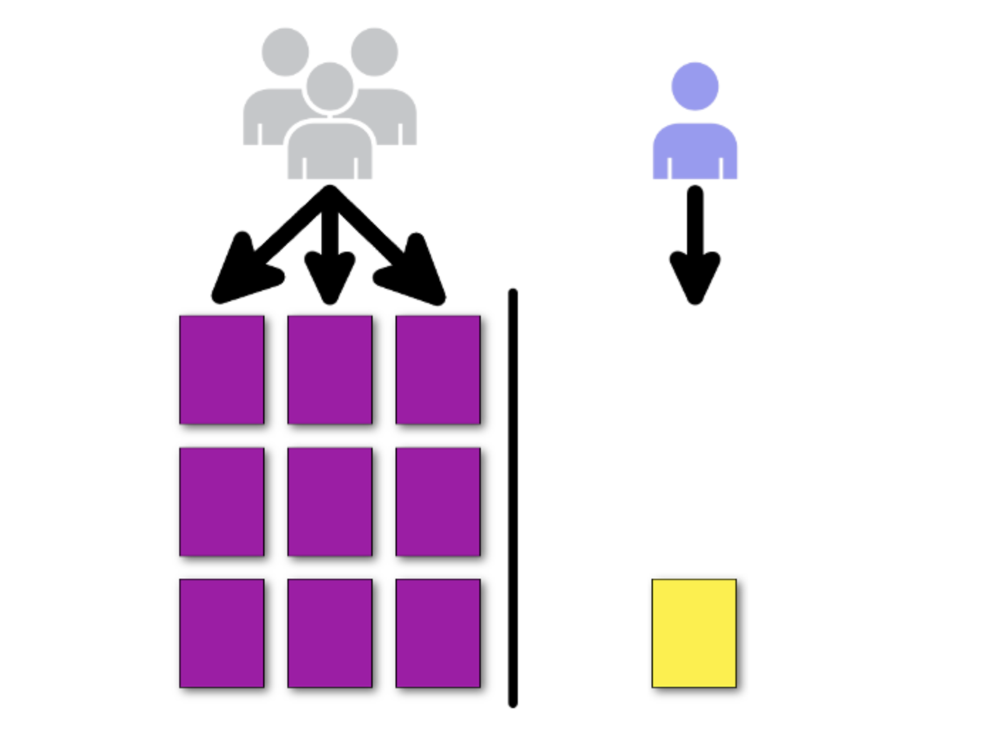

class: center, middle

### DevOps, Software Evolution and Software Maintenance


# Scaling


Mircea Lungu, Associate Professor,<br>
[IT University of Copenhagen, Denmark](https://www.itu.dk)<br>
`mlun@itu.dk`

---


## Before we Start: State of the Projects

**Logging**: 6/16 ... Keep up the good work!

**Security** ... how are we doing? 


---
### Latest processed events


<object width="100%" data="http://104.248.134.203/chart.svg"></object>

---


## What happens if one of your components fails in this system?


--

A system has a **single point of failure** if **a part of the system failing will stop the entire system from working**

---

## Is this scenario better? 


--

Nope. Here we just have more **single points of failure** because each hardware node is one. 

*Solution?*

---

## Redundancy

= **adding extra hardware and/or software components to the system and designing such that in case one fails, the other can take over**


- solution to single-point of failure
- challenge = keeping redundant components in sync

???

highly resilient system? human body: everycell has the whole DNA of the whole thing inside it

More on redundancy: https://csis.pace.edu/~marchese/CS865/Lectures/Chap8/New8/Chapter8.html

**Information Redundancy** – adding extra bits to allow for error detection/recovery (e.g., Hamming codes and the like).


---

# What happens when there is a spike in number of users?

Possible Reasons:
- [The Slashdot effect](https://en.wikipedia.org/wiki/Slashdot_effect)
- Seasonal spikes in demand
- Highly anticipated launch (e.g. the [healthcare.gov](https://www.cbsnews.com/news/healthcaregov-plagued-by-crashes-on-1st-day/) story)

--


???

[Amazon AWS history as a consequence of their scaling needs](https://digitalcloud.training/a-brief-history-of-aws-and-how-computing-has-changed/) 

Healtcare.gov 

> Instead of new choices, the website told him to wait. Attempts to log on with a CBS News producer's iPad failed too. 
> After more than an hour, he gave up.
> "I was excited to get on, and I can't, so yeah I'm disappointed," Matt Warren said.
> Matt Warren said he will try again Wednesday. There are about six million uninsured residents in Texas. It's estimated half of them could be covered by the Affordable Care Act.
https://www.cbsnews.com/news/healthcaregov-plagued-by-crashes-on-1st-day/


---
# Congestion

= **reduced quality of service that occurs when a network node or link is carrying more data than it can handle**

Solution to congestion?

--

**Scaling**
1. **Vertical**
2. **Horizontal**


---

# Vertical Scaling

**Replacing resources with larger or more powerful ones**

* In a physical server: open the hood, and add: more memory, harddisk, etc.
* In VMs: we can do that at runtime; still implies a temporary loss of service

* Usually a manual process (but can be automated)

---


## Example 1. Vertical Scaling with the VirtualBox  GUI

1. Power Off VM 
2. Modify RAM and storage (either via GUI or CLI)
3. Power On VM
4. From within the VM update the OS wrt your new disk size (takes a while!)


???

repartitioning 
  - e.g. with `gparted` or similar tools

---

## Example 2: VirtuaBox and CLI

```bash
$ VBoxManage list vms
"coursevm" {e072b310-1922-4113-93f5-2ca865e01722}
"lsd2018vm" {67fda2ea-7c3e-42f6-9a13-d0908020322d}
```

```bash
$ VBoxManage modifyvm "coursevm" --cpus 8
$ VBoxManage modifyvm "coursevm" --memory 8192
```


```bash
$ VBoxManage list hdds

UUID:           9953ea1b-7295-4547-94fa-209f49c258f5
Parent UUID:    base
State:          created
Type:           normal (base)
Location:       /path/to/node1ubuntu-16.04-amd64-disk001.vmdk
Storage format: VMDK
Capacity:       40960 MBytes
Encryption:     disabled
    ```
    
```sh
$ VBoxManage clonehd "9953ea1b-7295-4547-94fa-..." "cloned.vdi" --format vdi
$ VBoxManage modifymedium disk "cloned.vdi" --resize 65536
```

???

Optionally, you may want to convert the disk back to `vmdk` with `VBoxManage clonehd "cloned.vdi" "resized.vmdk" --format vmdk`


See More:
      * Modfication of RAM https://www.virtualbox.org/manual/ch08.html#vboxmanage-modifyvm 
      * Modification of storage https://www.virtualbox.org/manual/ch08.html#vboxmanage-modifyvd

---

## Example 3: Vertical Scaling with DigitalOcean

Similar to VirtualBox, only that on the Web

**You can only resize VMs that are not running**.


    


???

See https://www.digitalocean.com/docs/droplets/how-to/resize/#resizing-via-the-control-panel

---

## Example 4: Vertical Scaling With the REST API  of DigitalOcean


Resize CPU and RAM **automatically shuts down the droplet** 

```bash
$ curl -X POST -H 'Content-Type: application/json' \
	   -H "Authorization: Bearer $DIGITAL_OCEAN_TOKEN" \
	   -d '{"type":"resize","size":"s-2vcpu-4gb"}' \
	   "https://api.digitalocean.com/v2/droplets/$DROPLET_ID/actions" | jq

$ curl -X POST -H 'Content-Type: application/json' \
	   -H "Authorization: Bearer $DIGITAL_OCEAN_TOKEN" \
	   -d '{"type":"power_on"}' \
	   "https://api.digitalocean.com/v2/droplets/$DROPLET_ID/actions"
```

*Notes:* 
- $DIGITAL_OCEAN_TOKEN environment variable is defined
- $DROPLET_ID is defined
- Image types and sizes at: https://slugs.do-api.dev/

???

Discussion: why REST is particularily nice for IaC

---

## Contexts for Vertical Scaling

- Legacy systems (e.g. bank mainframes)

- Situations where **HW cost is lower than distributing the architecture** (developer cost & expertise might be higher than upgrading the HW)

- Some types of software that does not scale well horizontally (e.g. DBs that don't cluster well)


---
## Drawbacks of Vertical Scaling

2. Some services are too big for it

3.  Still has a single point of failure

4.  Can't adapt fast and easy to varying workload
	5. Complicated to scale down
	6. Slow -- it implies switching machines off and on 

???

Consider rewriting this into: contexts where VS does not work.

---

# Horizontal Scaling


= **Increasing the computing power by**
- **adding more machines* to a setup**
- **making all the machines share the responsibilities**


\*Initially was about physical machines. Nowadays VMs too.


---

### Why?!

--

**Lack of Alternative**

Some workloads exceed the capacity of the largest supercomputer and can only be handled by distributed systems, e.g. 
- [As of 2000 Google can not host all their DB on a single machine](https://www.linkedin.com/pulse/how-did-google-scale-untold-story-shrey-batra/?trk=articles_directory). In 2004 they introduce the [MapReduce paper](./papers/mapreduce-osdi04.pdf) and the whole world gets excited.

- [LinkedIn](https://engineering.linkedin.com/architecture/brief-history-scaling-linkedin): *"An easy fix we did was classic vertical scaling ... While that bought some time, we needed to scale further"*
- ...

--

**Cost**

Tasks that once would have required expensive supercomputers can be done for less:
- seismic analysis 
- biotechnology
- ...


???

We take it for granted, but it was a very revolutionary idea two decades ago

When they started, Google's index (a map) was small enough to fit on a single computer. In March of 2000, there was no Supercomputer that could process the index. The only way that Google could keep up was by buying normal computers and wiring them together into a fleet. Because half the cost of these computers was considered junk—floppy drives, metal chassis—the company would order raw motherboards and hard drives and sandwich them together. To survive, Google would have to unite its computers into a seamless, resilient whole

[hints at the google story](https://www.linkedin.com/pulse/how-did-google-scale-untold-story-shrey-batra/?trk=articles_directory) - of needing to scale beyond an individual machine

[Hadoop timeline](https://data-flair.training/blogs/hadoop-history/)
- defeats supecomputers in 2008
- yahoo deployes it on 1000 nodes in 2007


---
## Automated Load-Balancing

= **Distributing traffic to - and computation across multiple servers**

- Ensures no single server bears too much demand
- Improves responsiveness


Solves **scaling** but... 

--

... load balancer could still represent SPF

???

From: [Horizontally Scaling PHP Applications](https://blog.digitalocean.com/horizontally-scaling-php-applications/)


---
## Redundant Load Balancer Setup

Load balancer is not anymore a single point of failure ([setup description](https://www.digitalocean.com/community/tutorials/how-to-create-a-high-availability-setup-with-heartbeat-and-floating-ips-on-ubuntu-16-04))

[
](https://assets.digitalocean.com/articles/high_availability/ha-diagram-animated.gif)


- [Floating IP](https://blog.digitalocean.com/floating-ips-start-architecting-your-applications-for-high-availability/) 
	 - DigialOcean name for static IPs
	 - Equivalents on other platforms, e.g. Elastic IPs @ Amazon
- Keepalived - daemon used for health check


???

Provides increased availability 

- **Note:** Setup above is relevant for your project. [**Source**](https://www.digitalocean.com/community/tutorials/how-to-create-a-high-availability-setup-with-heartbeat-and-floating-ips-on-ubuntu-16-04)


Where to read more about this setup
- [**How To Set Up Highly Available Web Servers with Keepalived and Floating IPs**](https://www.digitalocean.com/community/tutorials/how-to-create-a-high-availability-setup-with-heartbeat-and-floating-ips-on-ubuntu-16-04)
- [Load Balancing as a Service on DO](https://blog.digitalocean.com/load-balancers-simplifying-high-availability/)
- [HAProxy with Keepalived on Ubuntu](https://kifarunix.com/configure-highly-available-haproxy-with-keepalived-on-ubuntu-20-04)

---

# Tools that Help With Horizontal Scaling

Specialized Tools for Distributing Computations
- Hadoop - Implementation of MapReduce
- Spark - Faster, more generic implementation


**Container Orchestration Tools**
- Managing **computing nodes** and services
- Resource aware task scheduling


---

## Many Container Orchestration Alternatives


**Docker Swarm Mode**
- Comes with Docker by default
- The easiest to use from all the alternatives


 **Kubernetes** 
  * Originally developed at Google
  * We don't ask you to use it because we're nice :) ([see hacker news discussion](https://news.ycombinator.com/item?id=26271470))

  
 ... and [many more](https://devopscube.com/docker-container-clustering-tools/)

  
---

## Docker Swarm Concepts

- Node = A VM instance participating in a swarm 
  1. Managers
  2. Workers
- Services 
- Tasks
- The Routing Mesh

---

### 1. Manager Node

  * Maintain cluster state
  * Schedule services
  * an *n manager swarm* tolerates maximum loss of *(n-1)/2* managers.


Notes: 
- Docker recommends a *maximum of seven manager nodes for a swarm* (!?!)
- More managers does NOT mean increased scalability or higher performance. In general, the opposite is true

---

### 2. Worker Node

  * Sole purpose to execute containers
  * Instances of Docker Engine 
  * Do not participate in scheduling decisions
  * Have at least one manager node
  * By default, all managers are also workers

???

See more https://docs.docker.com/engine/swarm/how-swarm-mode-works/nod

Docker engine is a runtime environment that allows you to create, run and manage containers

---

## 3. Service

**= the definition of the tasks to execute on the nodes**

- The primary abstraction of user interaction with the swarm 
- Is bound to a port


---

### Types of Services

Can be **replicated** or **global** (exactly one replica running on each node)


  


*What would you replicate?*

???

Good examples of global service? logging. It is important to ensure that the service is running on every node. By deploying the service as a global service, you can ensure that every node in the cluster has a copy of the service running, which can collect data from that node and forward it to a centralized location.

In a sense, global = highest availability. Replicated allows you to select the level of replication. 


---

## 4. Task
- The atomic scheduling unit of swarm
- Carries **a container and the commands to run inside it**
- Manager nodes assign tasks to worker nodes according to the number of replicas set in the service scale
 


"A service is a description of a desired state, and a task does the work"


???


Read more at: https://docs.docker.com/engine/swarm/key-concep


---

## 5. The Routing Mesh

- Routes all incoming requests to published ports on available nodes to an active container
- Enables each node in the swarm to accept connections 
  - on published ports 
  - for any service running in the swarm
  - even if there’s no task running on the node


- Can support load balancing in Docker Swarm


Read more:  https://docs.docker.com/engine/swarm/ingress

---

## New Docker Commands

    
    
  * `docker swarm` ... to manage a cluster (swarm)
  
  
  * `docker service` ... to manage replicated containers (services) in the swarm
  
???

* ~~`docker-machine` ... to manage virtual machines~~
    - usually used for quickly creating new VMs
    - creates machines locally on cloud providers
    - eases executing remote commands on the remote machines
    - as of end of 2020 - in maintenance mode


---

# Interactive 

### CLI Deployment of A Docker Swarm cluster on DigitalOcean


Assumes: 
- Definition envvar: $DIGITAL_OCEAN_TOKEN
- Availability the `jq`  command line tool (e.g., `brew install jq` on a mac)
- SSH public key [uploaded](https://docs.digitalocean.com/products/droplets/how-to/add-ssh-keys/to-team/#upload-an-ssh-key-to-a-digitalocean-team-with-the-control-panel)  in DigitalOcean>Settings>Security


---
### Creating a Docker Swarm Cluster Node


```sh
export DIGITALOCEAN_PRIVATE_NETWORKING=true
export DROPLETS_API="https://api.digitalocean.com/v2/droplets"
export BEARER_AUTH_TOKEN="Authorization: Bearer $DIGITAL_OCEAN_TOKEN"
export JSON_CONTENT="Content-Type: application/json"

```


```bash 

CONFIG='{"name":"swarm-manager","tags":["demo"],
	"size":"s-1vcpu-1gb", "image":"docker-20-04",
	"ssh_keys":["01:97:fe:0a:01:e3:a9:68:99:60:b5:e9:74:30:8f:71"]}'

SWARM_MANAGER_ID=$(curl -X POST $DROPLETS_API -d$CONFIG\
	-H $BEARER_AUTH_TOKEN -H $JSON_CONTENT\
	| jq -r .droplet.id ) && sleep 5 && echo $SWARM_MANAGER_ID
```


```bash

export JQFILTER='.droplets | .[] | select (.name == "swarm-manager") 
	| .networks.v4 | .[]| select (.type == "public") | .ip_address'


SWARM_MANAGER_IP=$(curl -s GET $DROPLETS_API\
    -H "Content-Type: application/json"\
    -H "Authorization: Bearer ${DIGITAL_OCEAN_TOKEN}"\
    | jq -r $JQFILTER) && echo "SWARM_MANAGER_IP=$SWARM_MANAGER_IP"

```

See: [Generating ssh key fingerprint](https://superuser.com/a/453022), [API doc for creating a droplet](https://docs.digitalocean.com/reference/api/api-reference/#operation/droplets_create) 


---

### Creating Worker Nodes


#### Worker1
```bash
WORKER1_ID=$(curl -X POST $DROPLETS_API\
       -d'{"name":"worker1","tags":["demo"],"region":"fra1",
       "size":"s-1vcpu-1gb","image":"docker-20-04",
       "ssh_keys":["01:97:fe:0a:01:e3:a9:68:99:60:b5:e9:74:30:8f:71"]}'\
       -H $BEARER_AUTH_TOKEN -H $JSON_CONTENT\
       | jq -r .droplet.id )\
       && sleep 3 && echo $WORKER1_ID
```

```bash

export JQFILTER='.droplets | .[] | select (.name == "worker1") | .networks.v4 | .[]| select (.type == "public") | .ip_address'


WORKER1_IP=$(curl -s GET $DROPLETS_API\
    -H $BEARER_AUTH_TOKEN -H $JSON_CONTENT\
    | jq -r $JQFILTER)\
    && echo "WORKER1_IP=$WORKER1_IP"

```

---

#### Worker2
```bash
WORKER2_ID=$(curl -X POST $DROPLETS_API\
       -d'{"name":"worker2","tags":["demo"],"region":"fra1",
       "size":"s-1vcpu-1gb","image":"docker-20-04",
       "ssh_keys":["01:97:fe:0a:01:e3:a9:68:99:60:b5:e9:74:30:8f:71"]}'\
       -H $BEARER_AUTH_TOKEN -H $JSON_CONTENT\
       | jq -r .droplet.id )\
       && sleep 3 && echo $WORKER2_ID
```

```bash

export JQFILTER='.droplets | .[] | select (.name == "worker2") | .networks.v4 | .[]| select (.type == "public") | .ip_address'


WORKER2_IP=$(curl -s GET $DROPLETS_API\
    -H $BEARER_AUTH_TOKEN -H $JSON_CONTENT\
    | jq -r $JQFILTER)\
    && echo "WORKER2_IP=$WORKER2_IP"

```


---

### Making `swarm-manager` a Cluster Manager


##### Open the ports that Docker needs
```sh
ssh root@$SWARM_MANAGER_IP "ufw allow 22/tcp && ufw allow 2376/tcp &&\
ufw allow 2377/tcp && ufw allow 7946/tcp && ufw allow 7946/udp &&\
ufw allow 4789/udp && ufw reload && ufw --force  enable &&\
systemctl restart docker"
```

##### Initialize the swarm
```sh
ssh root@$SWARM_MANAGER_IP "docker swarm init --advertise-addr $SWARM_MANAGER_IP"

```


```bash
Swarm initialized: current node (sozjy3nmfrieacm2pbgj41ek3) is now a manager.

To add a worker to this swarm, run the following command:

    docker swarm join --token SWMTKN-1-4rndqz4hwe38wtbl9fwgj33rk48ok3hri7a0xy42o7sf5ll38z-afkri2vu57m5z31v34bny16aj 142.93.109.102:2377

To add a manager to this swarm, run 'docker swarm join-token manager' and follow the instructions.```

---

### Converting node-1 and node-2 to Workers

##### Let's get that token from the swarm-manager

```sh
ssh root@$SWARM_MANAGER_IP "docker swarm join-token worker -q"
SWMTKN-1-4rndqz4hwe38wtbl9fwgj33rk48ok3hri7a0xy42o7sf5ll38z-afkri2vu57m5z31v34bny16aj

WORKER_TOKEN=`ssh root@$SWARM_MANAGER_IP "docker swarm join-token worker -q"`
```

##### and build a command that we can run on node-1 and node-2 to join the swarm.
```sh
REMOTE_JOIN_CMD="docker swarm join --token $WORKER_TOKEN $SWARM_MANAGER_IP:2377"

ssh root@$WORKER1_IP "$REMOTE_JOIN_CMD"
```

```
  This node joined a swarm as a worker.
```

```sh
ssh root@$WORKER2_IP "$REMOTE_JOIN_CMD"
```

```
  This node joined a swarm as a worker.
```


---

### Seeing the state of the cluster on the manager

```sh

$ ssh root@$SWARM_MANAGER_IP "docker node ls"

ID                            HOSTNAME            STATUS              AVAILABILITY        MANAGER STATUS      ENGINE VERSION
sozjy3nmfrieacm2pbgj41ek3 *   node-0              Ready               Active              Leader              18.09.0
hy6ie5xq561f9w1zpiyaqkrk5     node-1              Ready               Active                                  18.09.0
```

---

### Starting a Service

Now that everything is setup, let's run a service on our cluster:

```sh
$ ssh root@$SWARM_MANAGER_IP "docker service create -p 8080:8080 --name appserver stifstof/crashserver"
overall progress: 0 out of 1 tasks
...
overall progress: 1 out of 1 tasks
verify: Waiting 5 seconds to verify that tasks are stable...
...
verify: Waiting 1 seconds to verify that tasks are stable...
verify: Service converged
```

... about 1-2 min ..

---
### Checking the state of the service


```bash
$ ssh root@$SWARM_MANAGER_IP "docker service ls"
ID                  NAME                MODE                REPLICAS            IMAGE                        PORTS
ttkqm9wzthgu        appserver           replicated          1/1                 stifstof/crashserver:latest   *:8080->8080/tcp
```

You may directly ask for the state of a service with

```bash
$ ssh root@$SWARM_MANAGER_IP "docker service ps appserver"
```


Now, on a Mac you can: 

```sh
$ open http://$SWARM_MANAGER_IP:8080
```

Alternatively, navigate manually to the swarm manager's IP port 8080 and see the webpage served. 

---


### Checking that the Swarm also restarts services


To demonstrate this we used the ***crashserver service***
- a webserver which kills itself three seconds after serving an http request

Take some time and observe the behavior of the container before continuing with the guide. 
Note how the infrastructure is self-healing, by checking the state of the service multiple times after an invocation as shown above.

The service becomes unavailable while Swarm is recreating the container after it has been killed. 
Now we will scale the service to increase availability.

---
### Scaling the service

```bash
$ ssh root@$SWARM_MANAGER_IP "docker service scale appserver=5"
$ ssh root@$SWARM_MANAGER_IP "docker service ls"

ID                  NAME                MODE                REPLICAS            IMAGE                        PORTS
ttkqm9wzthgu        appserver           replicated          5/5                 stifstof/crashserver:latest   *:8080->8080/tcp


$ ssh root@$SWARM_MANAGER_IP \"docker service ps appserver\"


ID                  NAME                IMAGE                        NODE                DESIRED STATE       CURRENT STATE            ERROR               PORTS
vbg02o9bsaog        appserver.1         stifstof/crashserver:latest   node-1              Running             Running 7 minutes ago
mudpe1lokpj7        appserver.2         stifstof/crashserver:latest   node-0              Running             Running 13 seconds ago
t7enei6pz4jw        appserver.3         stifstof/crashserver:latest   node-0              Running             Running 12 seconds ago
sfpn4f2kg5nq        appserver.4         stifstof/crashserver:latest   node-1              Running             Running 39 seconds ago
wa8f99b6t199        appserver.5         stifstof/crashserver:latest   node-0              Running             Running 12 seconds ago
```

---

### Does the replication work?

You should now be able to invoke the webpage without seeing the error-page each time the container is killed, but instead see the request being served by another container. Nice!

Althrough it is possible to kill all container by manically invoking the /status endpoint, if you want to test the self-healing feature of swarm, you can invoke the /kill endpoint, which will kill the container immediately, so you don't have to wait.  

---

### What happens if you navigate to the worker node ips? 


```sh
open http://$WORKER1_IP:8080
```

```sh
open http://$WORKER2_IP:8080
```

--

**This is the routing mesh.** 

---

### Cleaning up to not pay anymore...


```bash
curl -X DELETE\
  -H $BEARER_AUTH_TOKEN -H $JSON_CONTENT\
  "https://api.digitalocean.com/v2/droplets?tag_name=demo"
  
```
See the [documentation](https://docs.digitalocean.com/reference/api/api-reference/#operation/droplets_destroy_byTag)  for the delete API endpoint


???

The guide is based on the [tutorial at DigitalOcean](https://www.digitalocean.com/community/tutorials/how-to-create-a-cluster-of-docker-containers-with-docker-swarm-and-digitalocean-on-ubuntu-16) 

---

# How do you **deploy a new version of the service when it's replicated**? 

--

#### Upgrade Strategies
1. Blue-Green
2. Canary
3. Rolling Updates

---

## Blue-green

**Two identical environments, where only one is hot at any time**


--

  1. Currently deployed application (Green) is serving incoming traffic
  2. New version (Blue) is deployed and tested, but not yet receiving traffic
  3. When Blue is ready, LB starts sending incoming traffic to it too
  4. For a while: two versions of the application run in parallel
  5. LB stops sending incoming traffic to the "Green"; "Blue" is handling all the incoming traffic
  6. Green can now be safely removed
  7. Blue is marked as Green...

  
  


???

"use the blue environment as your staging environment for the final testing step for your next deployment"

---


# Canary

**Deploy to a small group first, then deploy to the rest**


  
  
  
  [Article](https://martinfowler.com/bliki/CanaryRelease.html)  on martinfowler.com
  

---

# Rolling Updates

**Deploy in rolling iterations**

  
  
See https://opensource.com/article/17/5/colorful-deployme


---

## Docker Swarm 

Two update-order options: (stop-first|start-first) 
- stop-first (default) -- corresponds to rolling updates
- start-first -- corresponds to blue-green service deployment

Rolling Updates (stop-first):

1. Stop the first task
2. Schedule update for the stopped task
3. Start the container for the updated task
4. If the update to a task returns RUNNING, wait for the specified delay period (`--update-delay` flag) then start the next task
5. If, at any  me during the update, a task returns FAILED, pause the update

???

Note: You need at least two replicas otherwise there will be downtime

See: [Rolling Updates Swarm Tutorial](https://docs.docker.com/engine/swarm/swarm-tutorial/rolling-update/ ) 


---

# DB Migrations 

### With Blue Green Deployment 

From [article](https://martinfowler.com/bliki/BlueGreenDeployment.html)  on martinfowler.com: 

> "The trick is to separate the deployment of schema changes from application upgrades"


### Same DB

> "(One) variation would be to use the same database, making the blue-green switches for web and domain layers."


1. deploy a database refactoring to change the schema to support both the new and old version of the application, 
2. check everything is working fine so you have a rollback point, 
3. then deploy the new version of the application. 
4. And when the upgrade has bedded down remove the database support for the old version.


???

e.g. [renaming a column in the DB in a backwards compatible way](https://spring.io/blog/2016/05/31/zero-downtime-deployment-with-a-database)

How would you solve it with two different databases: https://www.linkedin.com/pulse/addressing-elephant-blue-green-room-data-deployment-using-madisa/


---

## Why not Horizontal Scaling?

**It can be more complicated that vertical** (see [hacker news thread on k8s](https://news.ycombinator.com/item?id=26271470))

--

**To *cargocult* what others (e.g. Google, Facebook) do**

- There are many large scale infras that use veritcal scaling
	- Thibault Duplessis on the architecture of Lichess
	- StackOverflow does not use horizontal scaling ([podcast](https://hanselminutes.com/847/engineering-stack-overflow-with-roberta-arcoverde), [tweet](images/StackOverflowInfraTweet.png))
- If Google needs it, than probably you don't 

--

**To make up for bad architecture**: algo, comm patterns, language, etc.

???


---


# What Next?

Exercise: *Try out the swarm creation example from this lecture*

Practical: [Scale your API](./README_TASKS.md)

Workshop: propose topics on the Teams channel