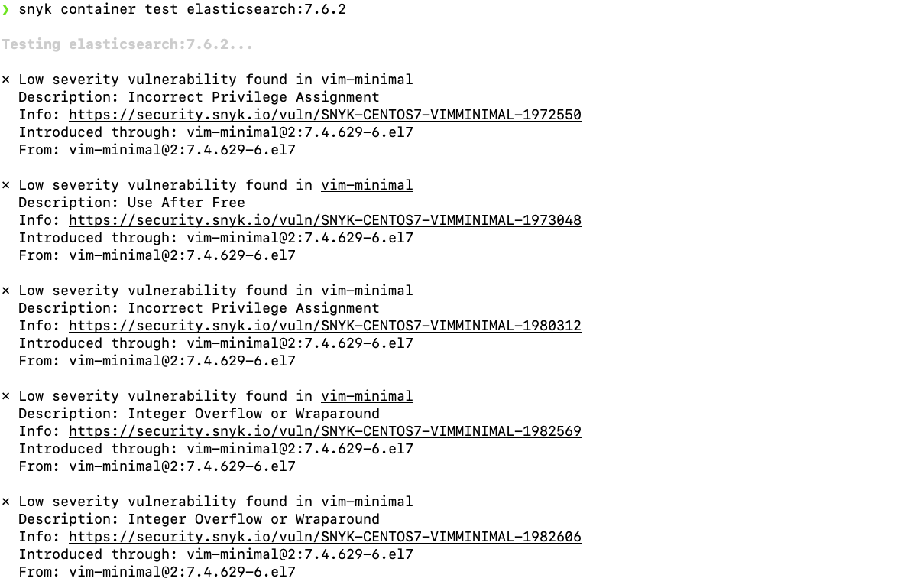
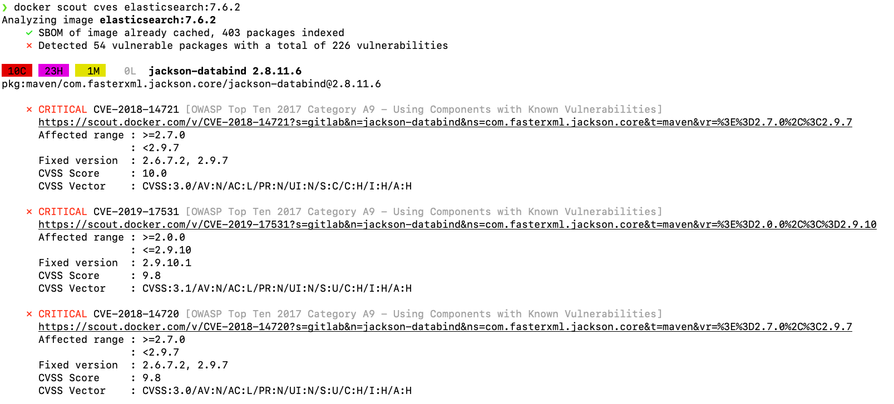
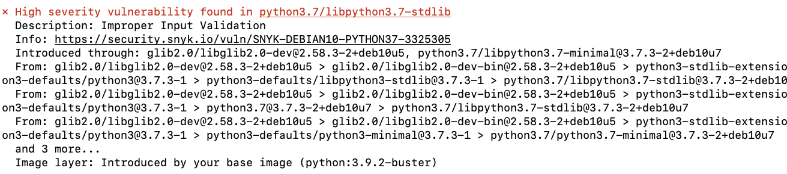

# Security in DevOps

Mircea Lungu
mlun@itu.dk
[IT University of Copenhagen, Denmark](https://www.itu.dk)<br>
[](https://www.inc.com/joe-galvin/60-percent-of-small-businesses-fold-within-6-months-of-a-cyber-attack-heres-how-to-protect-yourself.html)


# Motivation


## Why does FB need thousands of developers? 

Programming is easy and fun. 

Creating a proof-of-concept is not that hard. With a friend I once implemented  a Facebook clone in our spare time in parallel with doing our PhD. 

At the opposite spectrum maintaining Facebook itself takes thousands of talented developers working non stop on it. What is the difference? Where are all those man-hours going?


### Building Dependable Systems

My claim is that the reason is that they want to build a dependable system. And they also want to have a reliable process. 

Dictionary defines dependable as *trusthworthy* and *reliable*. This is the difference between my friend and my FB and the real deal. You can trust that millions of people have access to the real FB at any time and it's services will always be there. 


Sommerville decomposes **dependability** into multiple components: 

- **Availability**  -- probability that a system is operational at a given time -- Uptime / (Uptime + Downtime), e.g. "5 nines"

- **Reliability** -- probability of correct functioning  for some given time  -- MTBF = mean time between failures 

- **Safety**  -- ability to operate w/o catastrophic failure

- **Security** <-- fighting against the fact that "information wants to be free" :) I'll explain a bit later what this means.

I remember one of my friends once telling me proudly that he has been upgraded from engineer to site reliability engineer, and this was one of the most important roles in the company. 


### Historical Term: Site Reliability Engineer

The importance of reliability was recognized early by Google when they introduced the role of site reliability engineer and a [site-readability team in 2003](https://www.usenix.org/conference/srecon14/technical-sessions/presentation/keys-sre). 

> "The SRE role of today **combines** the skills of the **developer** responsible for writing applications and the skills that **operations engineers** use to deploy those applications. 

*To think about*: *how does this sound like something else that you know about?* 


What does an SRE do?

> The SRE moves an application from proof of concept, to quality control, and then to deployment – **automating that entire process** and giving it consistency.

*To think about: Does it sound like something else you know about?*


What else does an SRE do? 

> By **continuing to run security experiments**, we can evaluate and improve such vulnerabilities proactively in the ecosystem before they become crisis situations." 

Quotes from: [Through the looking glass: Security and the SRE](https://opensource.com/article/18/3/through-looking-glass-security-sre)

No stress about the terminology... what matters is the details. Automation, security, these are essential problems 


### "Information wants to be free"


> *Information wants to be free*
> 
> *Information also wants to be expensive.*
> 
> *That tension will not go away*

(From: The Media Lab: Inventing the future ..., by Stewart Brand)


The information in your systems wants to be free and many people are after it. Your goal is to protect it. This is **security**:

> ... the protection of computer systems and networks from the theft of or damage to their hardware, software, or  data, as well as from the disruption or misdirection of the services they provide. [1]

[1] https://commons.erau.edu/cgi/viewcontent.cgi?article=1476&context=jdfsl 


## Personal Story: that time when I migrated a web app to a new server and you will never guess what happened :)

Before the story, I must introduce two concepts that are related to security and devops.

### Concept: Reverse Proxy

- A Reverse Proxy is a server that: 
	- acts on behalf of one or more other servers
	- forwards the client requests to the appropriate servers
	- forwards responses back on behalf of the servers


[Forward proxy vs. reverse proxy: an analogy](https://www.pankajtanwar.in/blog/proxy-vs-reverse-proxy-using-a-real-life-example)

Why reverse proxy? 
- security
	- protecting ports done in a centralized manner
	- TLS deployed only once
- load balancing
- caching

### Concept: Firewall

A firewall is a system that limits access to servers and processes based on the **source** and **destination** of the accesses, where these are defined in terms of **IP_ADDRESS:PORT** pairs.  

Firewalls can be either hardware or software. 

Most often we'll be working with software firewall installed on our servers. 

E.g. allowing HTTP, SSL, and HTTPS traffic on a server with the help of [`iptables`](https://erravindrapawadia.medium.com/iptables-tutorial-beginners-to-advanced-guide-to-linux-firewall-839e10501759) firewall software: 

```
$  sudo iptables –A INPUT –p tcp  ––dport 80 –j ACCEPT
$  sudo iptables –A INPUT –p tcp ––dport 22 –j ACCEPT
$  sudo iptables –A INPUT –p tcp ––dport 443 –j ACCEPT

```
Or a simper, and more modern firewall software: [`ufw`](https://www.digitalocean.com/community/tutorials/how-to-set-up-a-firewall-with-ufw-on-ubuntu) where u stands for *uncomplicated*.  

```
$ sudo ufw allow ssh

Rule added
Rule added (v6)
```


### Back to the story

I moved my stack from one server to another.  

Next day I realize that the ElasticSearch queries don't work. I query the main index and don't find it. I look for all the indexes, and there is a new index in the db called `__read__me`. This is bad. I list the documents in it, and it has only a single document that you can see below: 


How could this happen? Let's see what I deployed on the new server: 
- Flask API talks to ElasticSearch and MySQL 
- NGINX - as *reverse proxy*  + TLS provide 
- `ufw` rules to block everything but ports 80 and 443
- Relevant docker-compose fragment is highlighted near the *elasticsearch*


The answer is a combination of factors:
- Docker circumvents the UFW firewall and alters iptables directly when you instruct it about ports
- Mapping the ports with `-p 9200:9200` (or in docker-compose) maps the port to the host but also opens it to the world! ([bug report from '19](https://github.com/docker/for-linux/issues/690))) 
	> Publishing ports produce a firewall rule that binds a container port to a port on the Docker host, ensuring the ports are accessible to any client that can communicate with the host.

- ElasticSearch server was not password protected - because I was sure that it's behind the firewall


Lessons learned:
- You must know how the tools you work with work! (e.g. [configure Docker to not do this](https://www.techrepublic.com/article/how-to-fix-the-docker-and-ufw-security-flaw/)) ) 
- You must have a backup - luckily the ES database was backed up so I didn't have to pay
- **Do not rely on a single security mechanism** (e.g. firewall) but use multiple (e.g. protect the ES db also with a password)


Practical
- Can you map the port for Grafana? Yes,.
- See also: [configure Docker to not do this](https://www.techrepublic.com/article/how-to-fix-the-docker-and-ufw-security-flaw/)


# State of the Security

So how likely was the scenario that I've presented before? Unfortunately quite likely. In an article about the [Cost of Data Breach Study](https://documents.ncsl.org/wwwncsl/Task-Forces/Cybersecurity-Privacy/IBM_Ponemon2017CostofDataBreachStudy.pdf) by IBM we learn that: 

1. **The most common way to discover security failures** is when a security incident happens. 
2. **Average time until people found out they were hacked** is quite long: 
	  - half a year
	  - By this time, it is often too late, and damage has been done. 

*Second hand anecdote*: Russian vs. Brazilian hackers.


# A Systematic Approach to Security
  
If one is to follow a  **systematic approach** to security, this would mean a four-pronged approach consisting of: 

  1. Understanding threats

  2. Assessing risks & hardening security
  
  3. Testing security

  4. Detecting breaches

In this section we will briefly discuss each of these in turn.

## Understanding Threats

### What is a threat? 

A threat is defined by a triplet:

1. Intent (we can guess)
2. Capability (we can't change)
3. Opportunity <-- (we can influence)


#### Threat Component: Intent and Capability

* **Black Hat** - bad intent, high capabilities (inspired from western movies)

* **Script Kiddies** - they have time on their hands and not good intentions

* White hat - ethical hackers, working with orgs to strengthen security

* Grey Hat - not malicious, usually notify you that they hacked you

In your case, most of the times it will be one of the first two. 


#### Threat Component: Opportunity

Opportunities - this is where you can have an impact. You can reduce the opportunity for threats. The way to do it is to analyze your system and think 

Framework for Discovering Opportunities for Web Applications: [Open Web Application Security Project](https://owasp.org/www-project-top-ten/) OWASP

- Online Community

- Maintains lists of vulnerabilities for web applications

- **OWASP Top 10** Include:
  1. [Broken Access Control](https://owasp.org/Top10/A01_2021-Broken_Access_Control/) : e.g., broken permissions, broken authorization
  3. [Injection](https://owasp.org/Top10/A03_2021-Injection/): e.g., XSS, SQL, etc.
  6. [Vulnerable and Outdated Components](https://owasp.org/Top10/A06_2021-Vulnerable_and_Outdated_Components/)
  9. [Security Logging and Monitoring Failures](https://owasp.org/Top10/A09_2021-Security_Logging_and_Monitoring_Failures/): e.g., auditable events are not logged, logs are not monitored for suspicious activity, etc. (See also the [Logging Cheatsheet](https://cheatsheetseries.owasp.org/cheatsheets/Logging_Cheat_Sheet.html) from OWASP).

##  Assessing risk

Any risk assessment has to prioritize addressing the risks based on their impact and probability. Usually for this one uses *risk matrices.*

### Risk Matrices

A way of visualizing the possible risks in terms of impact and probability. 

A possible template is this: 


Once you define the matrix, you place the risks that you identified in it. Then address the ones for which both impact and probability are highest first. 

You can define yourself the levels of: 

- **Probability** (**Likelihood**) e.g.: {Certain, Likely, Possible, Unlikely, Rare}

- **Impact** (**Severity**). e.g.: {Insignificant, Negligible, Marginal, Critical, Catastrophic}

Or you can reuse existing pre-defined levels. See two examples below.

#### e.g.: Levels of Severity 

cf. Security Risk Management Body of Knowledge


#### e.g.: Degrees of Likelihood

cf. Security Risk Management Body of Knowledge


## Testing

> "blue teams always need **red teams** to test them against each other"

Penetration Testing (a.k.a. pen-testing)
- simulate attacks on your system
- helps you understand what an attacker can do


### Automating Pen Testing

- Tools exist that can automate the process
- You provide a target IP and they scan it for vulnerabilities

- Kali Linux
  - security focused distro
  - contains a very large set of tools (https://tools.kali.org/tools-listing)
  - can be installed in meta-packages (https://www.kali.org/news/kali-linux-metapackages/)
	    - top10
	    - web
	    - wireless
	    - etc.


### Tool: Metasploit

- ruby-based framework for vulnerability scanning
- very popular
- large number of plugings


More: https://github.com/rapid7/metasploit-framework

A lot: https://books.google.dk/books?id=EOlODwAAQBAJ

### Tool: WMAP Plugin for Metasploit

- feature-rich web application vulnerability scanner 
- originally created from a tool named SQLMap
- integrated with Metasploit 
- see exercises for usage

[1] https://www.offensive-security.com/metasploit-unleashed/wmap-web-scanner/


### More Pen-Testing Tools

Inside Kali Linux
- [skipfish](https://www.systutorials.com/docs/linux/man/1-skipfish/)
- [nmap](https://nmap.org/book/man-port-scanning-basics.html)

Desktop Apps
- OWASP ZAP 
  - free, open-source penetration testing tool 
  - maintained under the umbrella of the OWASP 
  - [getting started](https://www.zaproxy.org/getting-started/), [docs](https://www.zaproxy.org/docs/api/#introduction)
- The tools in the [list of OWASP vulnerability scanning tools](https://owasp.org/www-community/Vulnerability_Scanning_Tools)

Online Services 
- Detectify (https://detectify.com/)
 - quite nice
 - requires an account
 - require you to prove that you own the website
- Mozilla Observatory (https://observatory.mozilla.org/)
- shodan.io


## Detecting Intrusions

Is hard. And it is usually a little bit too late. So better focus on preventing. 

### Warning signs that you might have an intruder

 - You can't access your server !!!
 - Your server IP has been blacklisted
 - Abnormal network traffic (that's why you monitor!)
 - Unusual resource usage (ditto)

### Detection - Approach

- Develop baseline for normal
- Monitor 

- Stop intruders from taking information out 
  - firewall
  - traffic filtering
  - white/black listing
  
- Auditing, compliance testing

 
# 10 Practical Advices to Improve Security in DevOps


## Evaluate, Scan & Update Dependencies


> **Principle**: *"If its part of your app, it should be part of your security process"*


One of the most important attack vectors on your system are all the ***giants*** your application is *"**standing on the shoulders of**"*. 


Best approach here is to:
- **Always keep dependencies up to date**
- This is why we use dependencies, to get updates for free and this is why they're better than copy-pasting code from generative ai tools.


One way to do that is to: 
- **Scan dependencies for security breaches**
  - source code and container images too (e.g. 
	  - `snyk` as a tool for scanning
	  - `docker scout` as a first-class command!
  - add security checks as part of your CI

Example of output from `snyk container test elasticsearch:7.6.2`: 






Or when I run `snyk` on my own project, `zeeguu/api` I get this as one example. Can you tell me what's the solution? 



Note: DockerHub has info about image vulns (e.g. [3.9.2-buster](https://hub.docker.com/_/python/tags?page=&page_size=&ordering=&name=3.9.2-buster) vs. [3.12.3](https://hub.docker.com/layers/library/python/3.12.3/images/sha256-49f4118027f9494ebe47d3d9b6c7a46b6d7454a19a7ba42eca32734d8108b323?context=explore)).  

**For your project**: consider adding a step in the CI/CD pipeline that checks for vulnerabilities

Case Study: [Postmortem for Malicious eslint Packages Published on July 12th, 2018](https://eslint.org/blog/2018/07/postmortem-for-malicious-package-publishes)

## Always Provide the Least Privileges Possible

What if the base image you depend on is malevolent? What if a dependency that you have is? 

Run your containers with least possible privileges, i.e., [do not run them as root](https://collabnix.com/running-docker-containers-as-root/#Why_Running_as_Root_Is_a_Concern). E.g. , switching to a new user after installing the required dependencies in the system.

```Dockerfile 
# Base image
FROM ubuntu:latest

# Install packages (**as root**)
RUN apt-get update && apt-get install -y curl

# Create a non-root user
RUN useradd -m myuser

# Switch to the non-root user
USER myuser

# Set the working directory
WORKDIR /home/myuser

# ... continue with other instructions ...

```
 
 For how not to trust code running in your web app see the [fascinating thought experiment about a malicious npm package](https://david-gilbertson.medium.com/im-harvesting-credit-card-numbers-and-passwords-from-your-site-here-s-how-9a8cb347c5b5)

 
## Never Trust User Input

> Principle: "All input is bad until proven otherwise"

Another attack vector is the **inputs in your application**. The photo below is from a legendary story where one good American citizen tried to delete the DB of the auto registry. 


The solution to this is: 
- **Validate web input before using it**
  - in the webpages
  - in the API

- Use parameterized DB queries (or whatever framework help you can)


## Protect  Servers

- Keep server software up to date
	- e.g. [`apt-get install unattended-upgrades`](https://wiki.debian.org/UnattendedUpgrades)


- System hardening
	- analyzes the system from within
	- treats the system as white box as opposed to blackbox
	- e.g. [`sudo lynis audit system`](https://www.digitalocean.com/community/tutorials/how-to-perform-security-audits-with-lynis-on-ubuntu-16-04#step-2-performing-an-audit)


## Protect Secrets

- Don’t commit credentials and other secrets (like keys and certs) into a VCS repository

- Use 2FA for secret repositories

- Consider using dedicated tools and vaults for secrets (e.g. `docker secret`)

Case Study: [The Uber Breach](https://www.bloomberg.com/news/articles/2017-11-21/uber-concealed-cyberattack-that-exposed-57-million-people-s-data) - started accessing a private GitHub repo, where keys were found for an AWS account, etc.

- Legend has it that when I was a student, one of the lecturers in our university has declared his love for his wife by sharing with her the root password for one of his servers. There are other ways to show love :) 


## Protect your CI/CD tools 

- CI pipeline is part of your infrastructure
- Make sure that it's secure (2FA, etc.)

Case Studies: 
- US government agencies [hacked due to misconfiguration of their TeamCity CI tool](https://cd.foundation/blog/2021/01/07/could-ci-cd-tool-teamcity-really-have-been-exploited-to-hack-the-us/)
- That very safe OS of NASA that red team changed the code


## Automatic Backups

- Data is probably your most precious asset; don't lose it

- Test your full recovery process! 

	- A backup is not useful unless you can use it to actually perform the backup

## Hack Your Own System

- Create a red team to pen test

- Stress the app infrastructure


## Use More than One Security Mechanism

- The example I gave you in the introduction: both firewall and application passwords

- Cloud based firewall but firewall also on every machine

- 2FA


## Log Your Application & Monitor Your Server

Monitor
- traffic
- accesses

Log everything. This is the key to being able to detect attacks 


# What Next?

- Exercise: [Pen testing with Metasploit / wmap](./README_EXERCISE.md)

- Practical: [Own security assessment + Hardening](./README_TASKS.md)

- TLS & Certbot: [TLSTutorial](../session_10/TLSTutorial.md)

