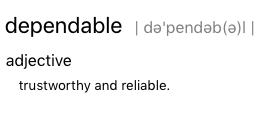
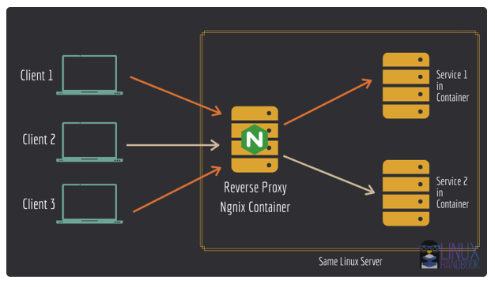
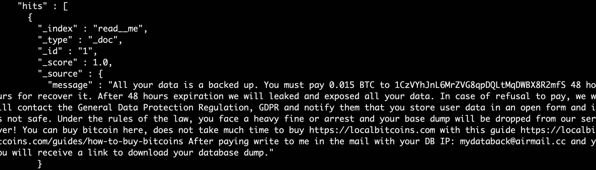
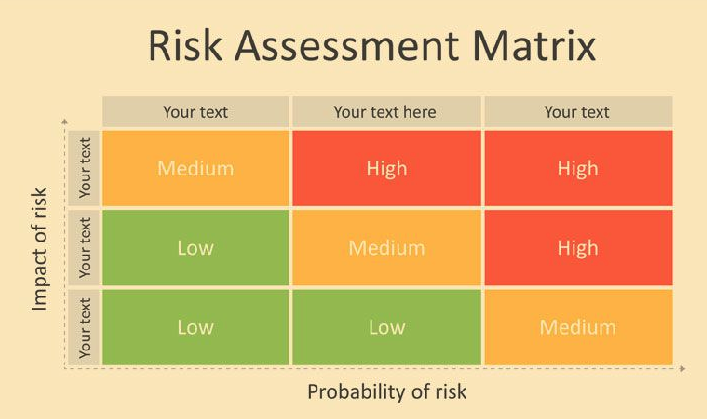
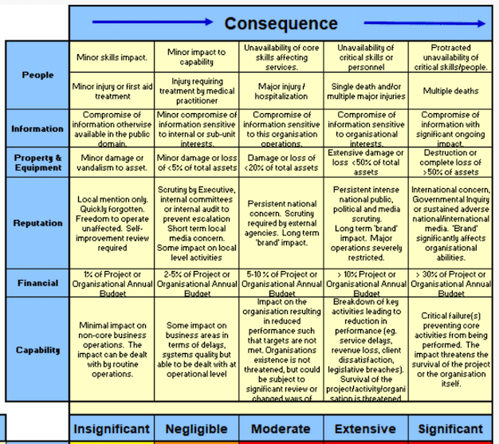
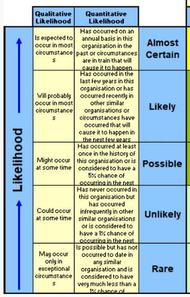

# Security in DevOps

Mircea Lungu

mlun@itu.dk

[IT University of Copenhagen, Denmark](https://www.itu.dk) 

Programming is easy and fun. Creating a proof-of-concept is not that hard. I once implemented with a friend a facebook clone in our spare time in parallel with doing our PhD. At the opposite spectrum maintaining Facebook itself takes thousands of developers working non stop on it. What is the difference? 

### Dependable Systems

Dictionary defines dependable as *trusthworthy* and *reliable*. This is the difference between my friend and my FB and the real deal. You can trust that millions of people have access to the real FB at any time and it's services will always be there. 

We want our systems to be dependable. Sommerville decomposes **dependability** into multiple components: 

- **availability**  -- probability that a system is operational at a given time -- Uptime / (Uptime + Downtime), e.g. "5 nines"

- **reliability** -- probability of correct functioning  for some given time  -- MTBF = mean time between failures 

- **safety**  -- ability to operate w/o catastrophic failure

- **security** <-- *today's focus*!!!!

### Intermezzo: Site Reliability Engineer

The importance of reliability was recognized early by Google when they introduced the role of site reliability engineer. I remember one of my friends once telling me proudly that he has been upgraded from engineer to site reliability engineer, and this was one of the most important roles in the company. 

> "The SRE role of today **combines** the skills of the **developer** responsible for writing applications and the skills that **operations engineers** use to deploy those applications. 
> 
> The SRE moves an application from proof of concept, to quality control, and then to deployment – **automating that entire process** and giving it consistency.
> 
> By **continuing to run security experiments**, we can evaluate and improve such vulnerabilities proactively in the ecosystem before they become crisis situations." 

([Through the looking glass: Security and the SRE](https://opensource.com/article/18/3/through-looking-glass-security-sre))

To think about: how does this compare with *devops*? 

## Security: What's the Problem? 

> Information wants to be free
> 
> Information also wants to be expensive.
> 
> That tension will not go away

The information in your systems wants to be free and many people are after it. Your goal is to protect it. This is **security**:

> ... the protection of computer systems and networks from the theft of or damage to their hardware, software, or  data, as well as from the disruption or misdirection of the services they provide. [1]

[1] https://commons.erau.edu/cgi/viewcontent.cgi?article=1476&context=jdfsl 

## Personal Story: that time when I migrated a web app to a new server

Before the story, I must introduce two concepts that are related to security and devops.

### New Term: Reverse Proxy

- A Reverse Proxy is a server that: 
	- acts on behalf of one or more other servers
	- forwards the client requests to the appropriate servers
	- forwards responses back on behalf of the servers

[Forward proxy vs. reverse proxy: an analogy](https://www.pankajtanwar.in/blog/proxy-vs-reverse-proxy-using-a-real-life-example)

Why reverse proxy? 
- security
	- protecting ports done in a centralized manner
	- TLS deployed only once
- load balancing
- caching

### New Concept: Firewall

A firewall is a system that limits access to servers and processes based on the source and destination of the accesses, where these are defined in terms of IP:PORT pairs. 

Firewalls can be either hardware or software. 

Most often we'll be working with software firewall installed on our servers. 

### Back to the story

I moved my stack from one server to another. 

Architecture presented in the diagram. 
- NGINX - as *reverse proxy*  + TLS provider
- Relevant docker-compose fragment is highlighted near the *elasticsearch*.
- `UFW` as more *uncomplicated* firewall than `iptables`
	- rules to block everything but ports 80 and 443

Next day I realize that the ElasticSearch DB size is very small. Looking in the database, I see a single document: 

How could this happen? The answer is a combination of factors:
- Docker circumvents the UFW firewall and alters iptables directly when you instruct it about ports
- Mapping the ports with `-p 9200:9200` (or in docker-compose) maps the port to the host but also opens it to the world! ([bug report from '19](https://github.com/docker/for-linux/issues/690))) 
	> Publishing ports produce a firewall rule that binds a container port to a port on the Docker host, ensuring the ports are accessible to any client that can communicate with the host.

- ElasticSearch server was not password protected - because I was sure that it's behind the firewall

Lessons learned:
- you must know how the tools that you work with ([configure Docker to not do this]([descriptive article](https://www.techrepublic.com/article/how-to-fix-the-docker-and-ufw-security-flaw/))
- you must have a backup - luckily the ES database was backed up so I didn't have to pay
- do not rely on a single security mechanism (e.g. firewall) but use multiple (e.g. protect the ES db also with a password)

# State of the Security

So how likely was the scenario that I've presented before? Unfortunately security breaches are quite likely in fact. In an article about the [Cost of Data Breach Study](https://documents.ncsl.org/wwwncsl/Task-Forces/Cybersecurity-Privacy/IBM_Ponemon2017CostofDataBreachStudy.pdf) by IBM we learn that 

- **The most common way to discover security failures?** is when a security incident happens 
- **Average time until people found out they were hacked?**
  - half a year! [1]
  - By this time, it is often too late, and damage has been done. 
  - *Story*: Russian vs. Brazilian hackers.

# A Systematic Approach to Security
  

**We need a proactive and systematic approach**, and this means 

  1. Understanding threats
  
  2. Assessing risk
  
  3. Testing security

  4. Detecting breaches

In this section we will briefly discuss each of these in turn.

## 1. Understanding Threats

### What is a threat? 

A threat is defined by a triplet:

1. Intent (we can guess)
2. Capability (we can't change)
3. Opportunity <-- (this is our focus!)

#### 1&2: Intent and Capability Define Attackers

* **Black Hat** - bad intent, high capabilities (inspired from western movies)

* **Script Kiddies** - they have time on their hands and not good intentions

* White hat - ethical hackers, working with orgs to strengthen security

* Grey Hat - not malicious, usually notify you that they hacked you

In your case, most of the times it will be one of the first two. 

#### 3: Opportunity

Opportunities - this is where you can have an impact. You can reduce the opportunity for threats. 

Framework for Discovering Opportunities for Web Applications: [Open Web Application Security Project](https://owasp.org/www-project-top-ten/) OWASP

- Online Community

- Maintains lists of vulnerabilities for web applications

- **OWASP Top 10** Include:
  1. Broken Access Control
  3. Injection (XSS, SQL, etc.)
  7. Identification and Authenticaion Failures
  9. Insufficient Logging & Monitoring (!!!)

##### OWASP Detail: Insufficient Logging and Monitoring

Included in the Top 10 **based on an industry survey**

Strategy for determining if you have **sufficient monitoring**

- examine the logs following *penetration testing* 

- the testers’ actions should be recorded sufficiently to understand what damages they may have inflicted

Note: *applying this strategy is part of your assignment*

##### OWASP Detail: Insufficient Logging and Monitoring

This is considered to be the case when: 

- Auditable events are not logged
  - e.g. logins, failed logins, and high-value transactions

- Warnings and errors generate no log messages
  - (or inadequate, or unclear)

- You're not looking at the logs!
- The application is unable to detect, escalate, or alert for active attacks in real time or near real time.

Source: [OWASP Top 10: Insufficient Logging and Monitoring](https://owasp.org/www-project-top-ten/OWASP_Top_Ten_2017/Top_10-2017_A10-Insufficient_Logging%252526Monitoring)

Logging Cheatsheet from OWASP: https://cheatsheetseries.owasp.org/cheatsheets/Logging_Cheat_Sheet.html

##  Assessing risk

Any risk assessment has to prioritize addressing the risks based on their impact and probability. Usually for this one uses *risk matrices.*

### Risk Matrices

A way of visualizing the possible risks in terms of impact and probability. 

A possible template is this: 

Once you define the matrix, you place the risks that you identified in it. Then address the ones for which both impact and probability are highest first. 

You can define yourself the levels of: 

- **Probability** (**Likelihood**) e.g., Certain, Likely, Possible, Unlikely, Rare

- **Impact** (**Severity**). e.g., Insignificant, Negligible, Marginal, Critical, Catastrophic

Or you can reuse existing pre-defined levels. 

#### e.g.: Levels of Severity 

cf. Security Risk Management Body of Knowledge

#### e.g.: Degrees of Likelihood

cf. Security Risk Management Body of Knowledge

## 3. Testing

> "blue teams always need **red teams** to test them against each other"

Penetration Testing (a.k.a. pen-testing)
- simulate attacks on your system
- helps you understand what an attacker can do

### Automating Pen Testing

- Tools exist that can automate the process
- You provide a target IP and they scan it for vulnerabilities

- Kali Linux
  - security focused distro
  - contains a very large set of tools (https://tools.kali.org/tools-listing)
  - can be installed in meta-packages (https://www.kali.org/news/kali-linux-metapackages/)
	    - top10
	    - web
	    - wireless
	    - etc.

### Tool: Metasploit

- ruby-based framework for vulnerability scanning
- very popular
- large number of plugings

More: https://github.com/rapid7/metasploit-framework

A lot: https://books.google.dk/books?id=EOlODwAAQBAJ

### Tool: WMAP Plugin for Metasploit

- feature-rich web application vulnerability scanner 
- originally created from a tool named SQLMap
- integrated with Metasploit 
- see exercises for usage

[1] https://www.offensive-security.com/metasploit-unleashed/wmap-web-scanner/

### More Pen-Testing Tools

Inside Kali Linux
- [skipfish](https://www.systutorials.com/docs/linux/man/1-skipfish/)
- [nmap](https://nmap.org/book/man-port-scanning-basics.html)

Desktop Apps
- OWASP ZAP 
  - free, open-source penetration testing tool 
  - maintained under the umbrella of the OWASP 
  - [getting started](https://www.zaproxy.org/getting-started/), [docs](https://www.zaproxy.org/docs/api/#introduction)
- The tools in the [list of OWASP vulnerability scanning tools](https://owasp.org/www-community/Vulnerability_Scanning_Tools)

Online Services 
- Detectify (https://detectify.com/)
 - quite nice
 - requires an account
 - require you to prove that you own the website
- Mozilla Observatory (https://observatory.mozilla.org/)
- shodan.io

## 4. Detecting Intrusions

Is hard.

### Warning signs that you might have an intruder

 - you can't access your server !!! 
 - your server IP has been blacklisted
 - abnormal network traffic (important to monitor!)
 - unusual resource usage (ditto)

### Detection - Approach

- Develop baseline for normal

- Stop intruders from taking information out 
  - firewall
  - traffic filtering
  - white/black listing
  
- Auditing, compliance testing

 
# 8 Practical Steps to Improve Security

## Evaluate & Update Dependencies

- Scan dependencies for security breaches
  - source code and container images too
  - add security checks as part of your CI

- Keep dependencies up to date

**Principle**

  > "If its part of your app, it should be part of your security process"

##### Case Study
- [Postmortem for Malicious eslint Packages Published on July 12th, 2018](https://eslint.org/blog/2018/07/postmortem-for-malicious-package-publishes)

## Never Trust User Input

> Principle: "All input is bad until proven otherwise

- Validate the input before using it
  - in the webpages
  - in the API
- Use parameterized DB queries (or whatever framework help you can)

## Protect  Servers

- Keep server software up to date
	- e.g. [`apt-get install unattended-upgrades`](https://wiki.debian.org/UnattendedUpgrades)

- System hardening
	- analyzes the system from within
	- treats the system as white box as opposed to blackbox
	- e.g. [`sudo lynis audit system`](https://www.digitalocean.com/community/tutorials/how-to-perform-security-audits-with-lynis-on-ubuntu-16-04#step-2-performing-an-audit)

## Protect Secrets

- Don’t commit credentials and other secrets (like keys and certs) into a VCS repository

- Use 2FA for secret repositories

- Consider using dedicated tools and vaults for secrets

##### Case Study
- [The Uber Breach](https://www.bloomberg.com/news/articles/2017-11-21/uber-concealed-cyberattack-that-exposed-57-million-people-s-data) - started accessing a private GitHub repo, where keys were found for an AWS account, etc.

---

## Protect your CI/CD tools 

- CI pipeline is part of your infrastructure
- Make sure that it's secure (2FA, etc.)

##### Case Study

- US government agencies [hacked due to misconfiguration of their TeamCity CI tool](https://cd.foundation/blog/2021/01/07/could-ci-cd-tool-teamcity-really-have-been-exploited-to-hack-the-us/)

- That very safe OS of NASA that red team changed the code of

## Hack Yourself

- Create a red team to pen test

- Stress the app infrastructure

## Log Everything 

- Your key to being able to detect attacks 

## Automatic Backups

- Data is probably your most precious asset; don't lose it

- Test your full recovery process! 

	- A backup is not useful unless you can use it to actually perform the backup

---

## Use More than One Security Mechanism
- the example I gave you in the introduction: both firewall and application passwords
- 2FA
- etc.
## Monitor your server
- traffic
- accesses

All these might help you discover an intrusion. 

Legend has it that when I was a student, one of the lecturers in our university has declared his love for his wife by sharing with her the root password for one of his servers. That is unnecessary :) 

# What Next?

- Exercise: [Pen testing with Metasploit / wmap](https://github.com/itu-devops/lecture_notes/blob/master/sessions/session_09/README_EXERCISE.md)

- Practical: [Own security assessment + Hardening](./README_TASKS.md)

- TLS & Certbot? 