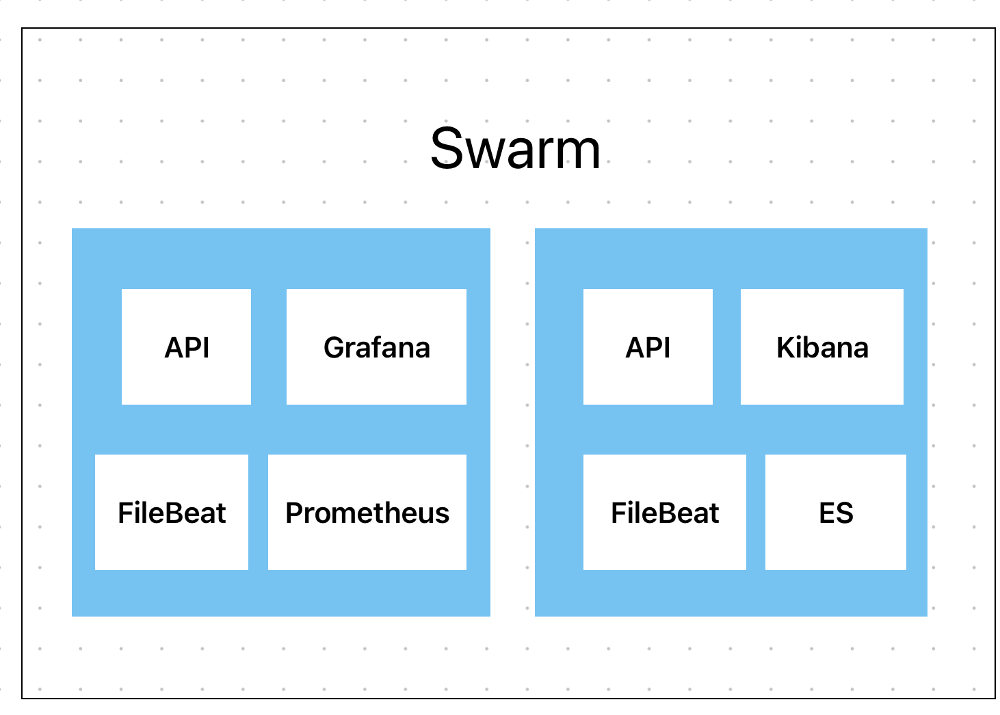
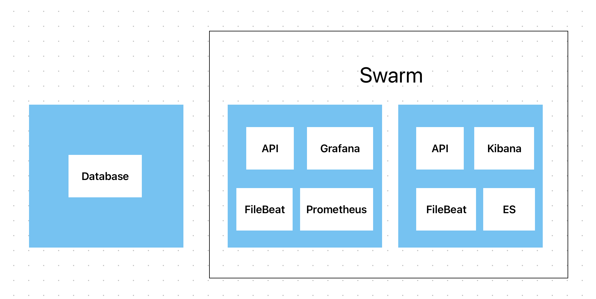
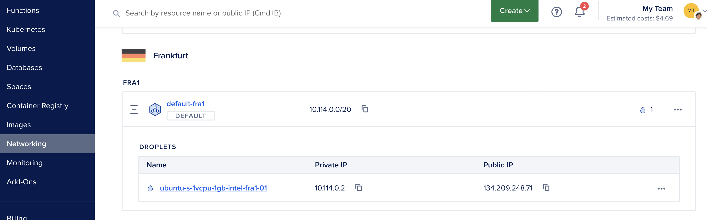
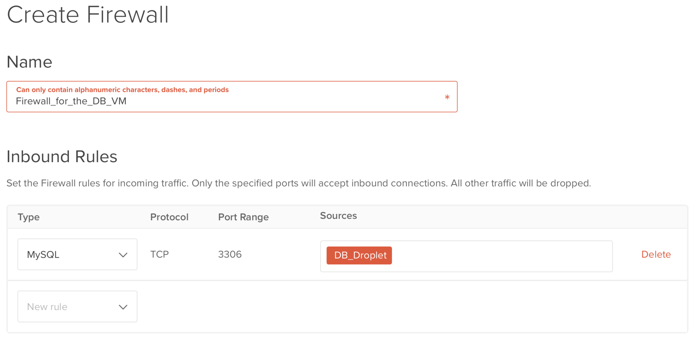
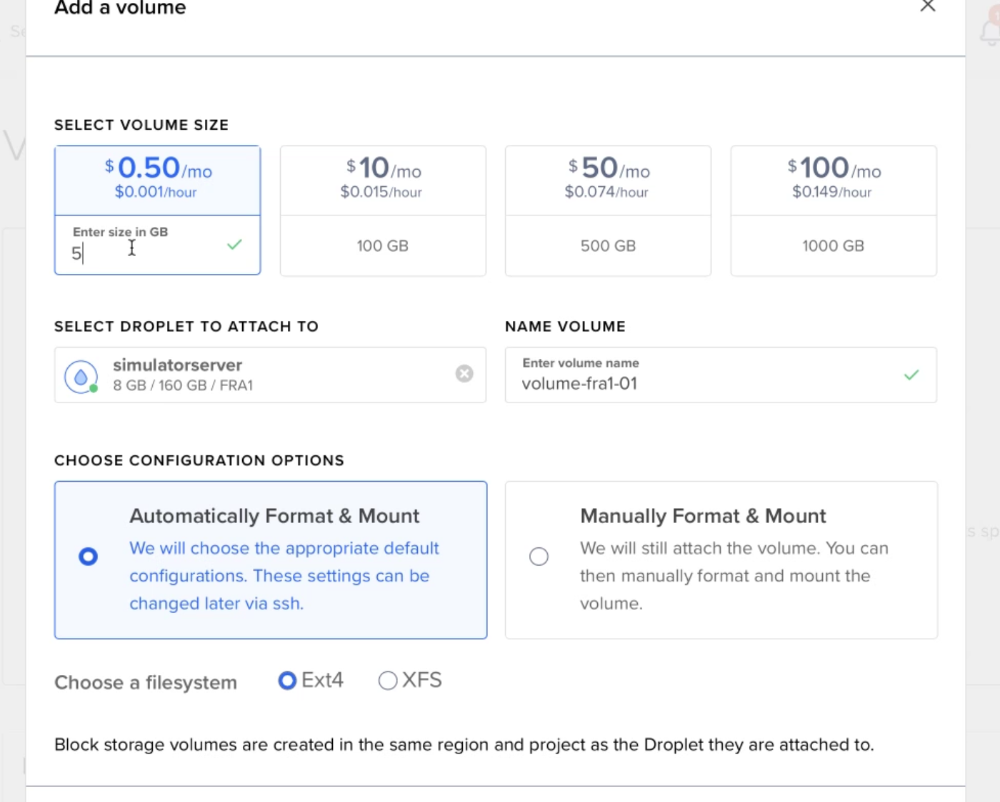
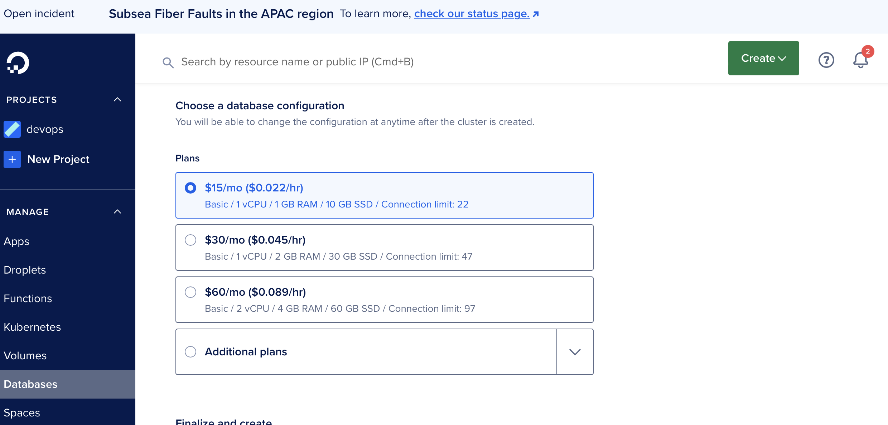

class: center, middle

### DevOps, Software Evolution and Software Maintenance


# Architectural Solutions with Swarm


Mircea Lungu, Associate Professor,<br>
[IT University of Copenhagen, Denmark](https://www.itu.dk)<br>
`mlun@itu.dk`

---


## To Think About

1. How do you migrate from `compose` to `swarm`?
3. What do you replicate?
4. Where do you keep the database?
6. How do you handle the monitoring in the swarm context?
7. How do you ensure that your replicated services are stateless?


---
# 1. From Docker-Compose to Docker-Swarm

Simplest way is to add the extra information needed in the docker-compose.yml 
- deploy:
	- replicas: *minimum requirement*
	- [placement constriants](https://docs.docker.com/engine/swarm/services/)
		- work with labels
			- e.g. manager, worker are default
			- you can add labels to individual VMs 
		- or any other info about the node, e.g. 

```
  api:
    image: itudevops/go-minitwit-api:TAG
    deploy:
      replicas: 2
      update_config:
        delay: 10s
        order: start-first
      placement:
        constraints:
          - "node.role==manager"
          - "node.hostname!=dbvm"
```

See: [reference manaual for compose deploy](https://docs.docker.com/compose/compose-file/deploy/) More on [service constraints](### Specify service constraints)


---
# What do you replicate?




- Very likely the API 
- The log shipper (e.g. FileBeat) -- must be on every VM

Also answers: "How do you handle logs"?

--

### ... and what **not** to replicate?
- Databases that are not replicatable
- The stuff that's not critical (e.g. Kibana, Prometheus)

---
# Where do you keep the database? 

1. Database on Separate VM
2. Database in the Swarm
3. Managed Database


---

## 1. Database on Separate VM



- Configure the DB (e.g. MySQL) and firewall on the VM with the DB such that it does not allow connections from outside the swarm
- In the configuration of your API, use the IP of the DB machine

*Advantages?*

--

- Realistic - you often need to connect to services which are not in the swarm 
- No worry about the DB VM becoming loaded with other swarm services

---

### DigitalOcean Example

- VMs in the same region are in the default VPC (defined by subnet mask)
- Easy to configure the firewall to only accept connections from IPs in the local subnet




---
## Configuring Firewall from the DO Dashboard



---

## 2. Database in the Swarm

- The DB is also part of your swarm stack
- Use placement constraints to ensure DB task always on the same VM
- In the configuration for your API use the service name from the docker-compose file
- DB data mapped in persistent volume

Advantages
- this removes the need to firewall and configure the DB to prevent possible external access -- it is only visible from the swarm overlay network 

---

## Variation: using a managed volume



Advantage: easily changing VMs for the DB

---

## 3. Managed Database



- You connect to it with an explicit IP as you did also in the DB in the Separate VM 
- you still have to configure connection rules and firewall for that VM but this time via the DigitalOcean CLI tool, REST API, or by clicking around (but that's not cool)

disadvantage
- more expensive than the cheapest VM 


---

# What kinds of services are easy to replicate? 


*What could be problematic in your current state of the API if you replicate it?* 

--

If you have `state` that remmebers details about the client
	- e.g. the clients that are currently logged in
	- the last processed ID
Then, if the client is routed to a different replica, they might be surprised.

--

A: Stateless services = A type of software application or system that does not store any data or state information related to a user or client's session between different requests.

---

# How do you ensure that your replicated services are stateless?


Refactor data to the DB

*What if that's too slow?*

--

Move some of the data to a distributed in-memory DB, e.g. **RE**mote **DI**ctionary **S**erver ([redis](https://collabnix.com/getting-started-with-redis-inside-docker-container-in-2-minutes/))

Use specific tactics: e.g., JWT (JSON Web Tokens)


