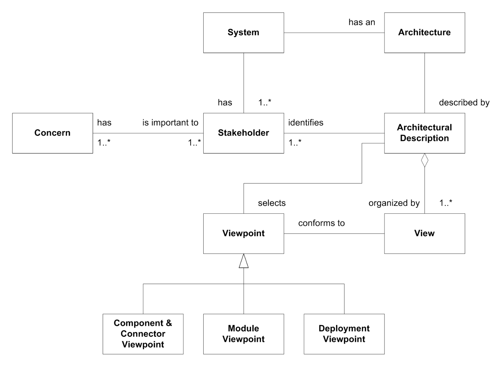
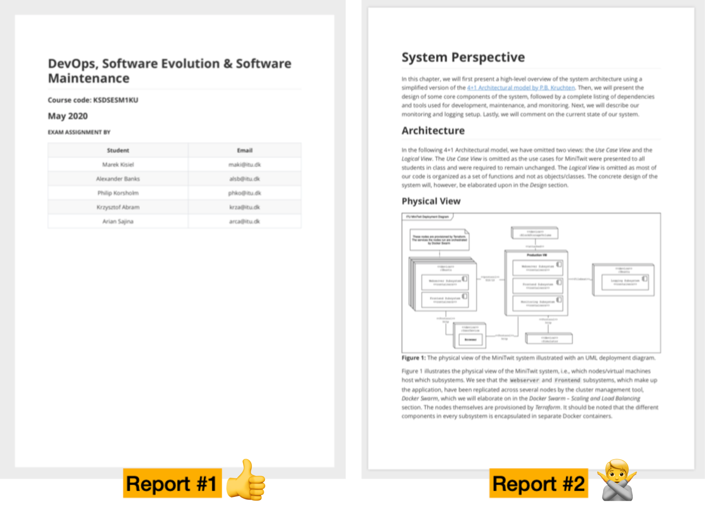
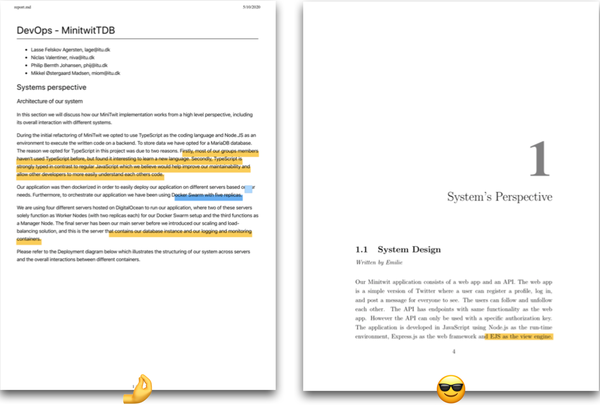
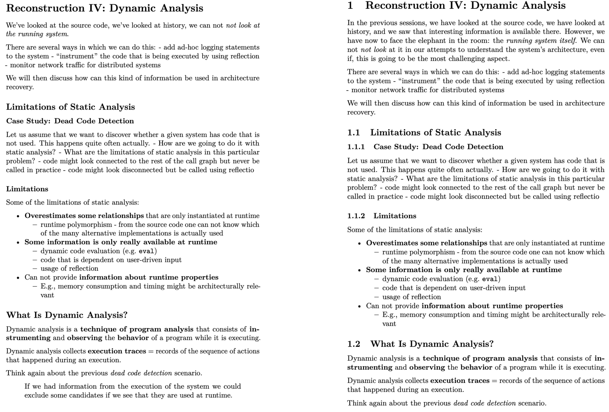
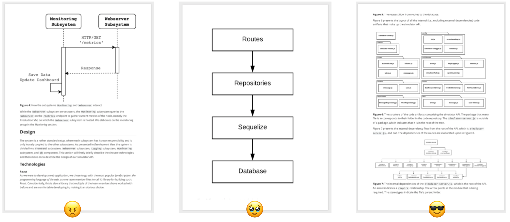

Wclass: center, middle

# DevOps, Software Evolution and Software Maintenance

Helge Pfeiffer, Associate Professor, 
[Research Center for Government IT](https://www.itu.dk/forskning/institutter/institut-for-datalogi/forskningscenter-for-offentlig-it), 
[IT University of Copenhagen, Denmark](https://www.itu.dk) 
`ropf@itu.dk`

---

# What to do now?

  * Start writing your [report](./REPORT.md)

But how?

---

## Architectural Viewpoints = Perspectives on a system

Source: Henrik Bærbak Christensen, et al. [_An Approach to Software Architecture Description Using UML_](https://pure.au.dk/ws/portalfiles/portal/15565758/christensen-corry-marius-2007.pdf)

---

## Viewpoints???

- _Static_ view of the system:
  - **Module viewpoint**: _"concerned with how functionality of the system maps
to static development units"_
  - **Allocation viewpoint**: _"concerned with how software entities are mapped to environmental entities"_

- _Dynamic_ view of the system:
  - **Component & Connector viewpoint**: _"concerned with the runtime mapping of functionality to components"_

Adapted from: Henrik Bærbak Christensen, et al. [_An Approach to Software Architecture Description Using UML_](https://pure.au.dk/ws/portalfiles/portal/15565758/christensen-corry-marius-2007.pdf)

---

## Possible Notations

- _Static_ view of the system:
  - **Allocation viewpoint**: UML deployment diagrams
  - **Module viewpoint**: UML [package](https://www.uml-diagrams.org/package-diagrams-overview.html) and [component](https://www.uml-diagrams.org/component-diagrams.html) diagrams
- _Dynamic_ view of the system:
  - **Component & Connector viewpoint:**: UML (Sub-)system [sequence](https://www.uml-diagrams.org/sequence-diagrams.html) diagrams

---

class: center, middle

# Examples

---

## Allocation viewpoint: UML Deployment Diagrams

Source: https://www.uml-diagrams.org/deployment-diagrams-overview.html

---

## Allocation viewpoint: UML Deployment Diagrams

Source: https://en.wikipedia.org/wiki/Deployment_diagram

---

## Allocation viewpoint: UML Deployment Diagrams

Source: https://agilemodeling.com/style/deploymentDiagram.htm

---

## Allocation viewpoint: UML Deployment Diagrams

Source: https://www.uml-diagrams.org/web-application-clusters-uml-deployment-diagram-example.html?context=depl-examples

---

## Component & Connector viewpoint: UML System Sequence Diagrams

Source: https://www.uml-diagrams.org/sequence-diagrams.html

---

## Component & Connector viewpoint: UML System Sequence Diagrams

Source: https://www.uml-diagrams.org/pluck-comments-uml-sequence-diagram-example.html

---

## Component & Connector viewpoint: UML System Sequence Diagrams

Source: https://www.uml-diagrams.org/facebook-authentication-uml-sequence-diagram-example.html

---

## Component & Connector viewpoint: UML System Sequence Diagrams

Source: https://www.uml-diagrams.org/examples/spring-hibernate-transaction-sequence-diagram-example.html

---

---

## Process view: UML Activity Diagrams

Source: https://www.uml-diagrams.org/shopping-process-order-uml-activity-diagram-example.html?context=activity-examples

---

## Process view: UML Activity Diagrams

Source: https://www.uml-diagrams.org/software-resolve-issue-uml-activity-diagram-example.html

---

## Process view: Custom Notation

Source: https://strategicfocus.com/2021/10/06/model-training-as-a-ci-cd-system-part-i/

You’re free to invent your own notation, but then, you should add a legend. And make sure that it makes sense!

---

## Process view: Custom Notation

Source: https://medium.com/@ojijosh2002/ci-cd-pipeline-design-and-build-for-a-banking-application-on-azure-devops-9f068c57fefc

---

## Process view: Custom Notation

---

class: center, middle

# Formatting Your Report
### Make it as readable as possible

---

## A Report Has a Title and Authors

---

## A Report Has a Structure

---

### Section Numbers Matter

Use `--number-sections` with pandoc to convert markdown files, see e.g., https://pandoc.org/MANUAL.html or https://github.com/mircealungu/reconstruction/blob/master/tools/md_to_pdf.sh

---

## Figure and Text font sizes should be similar

https://github.com/mircealungu/student-projects/blob/master/writing_guidelines/Use_the_Right_Font_Size_in_Images.md

---

# What to do now?

We run an **evaluation** that should be really easy and should consume only a few minutes of your time.
The purpose of the evaluation is to provide feedback so that Mircea and I can improve the course next year.

We would like to ask you to provide up to three negative and up to three positive comments about the course. You can do that here: http://138.68.66.124:8888/
Please note, the kind of evaluation we are running mimics a public paper-based process.
That is, all information that you enter as feedback will be read by Mircea and me, i.e., it is public information.
Please provide your feedback latest by Tuesday (May 6th) 12:00.

Thank you in advance.
