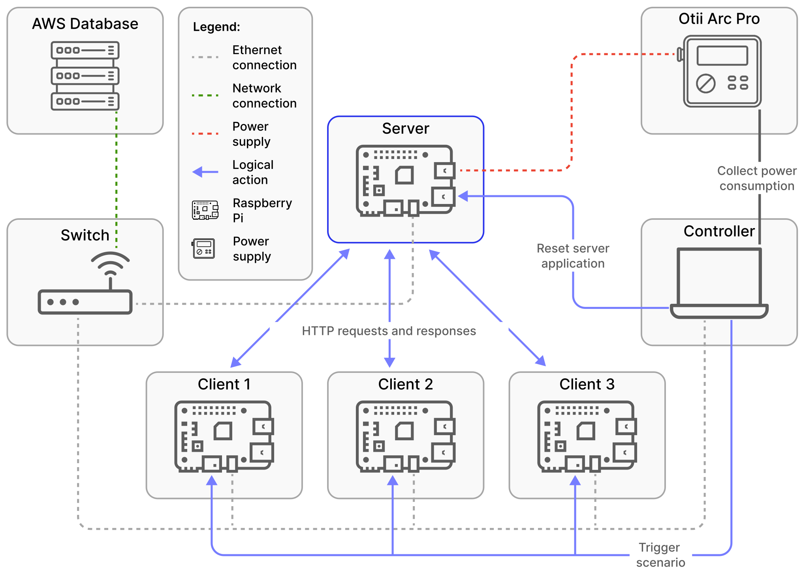
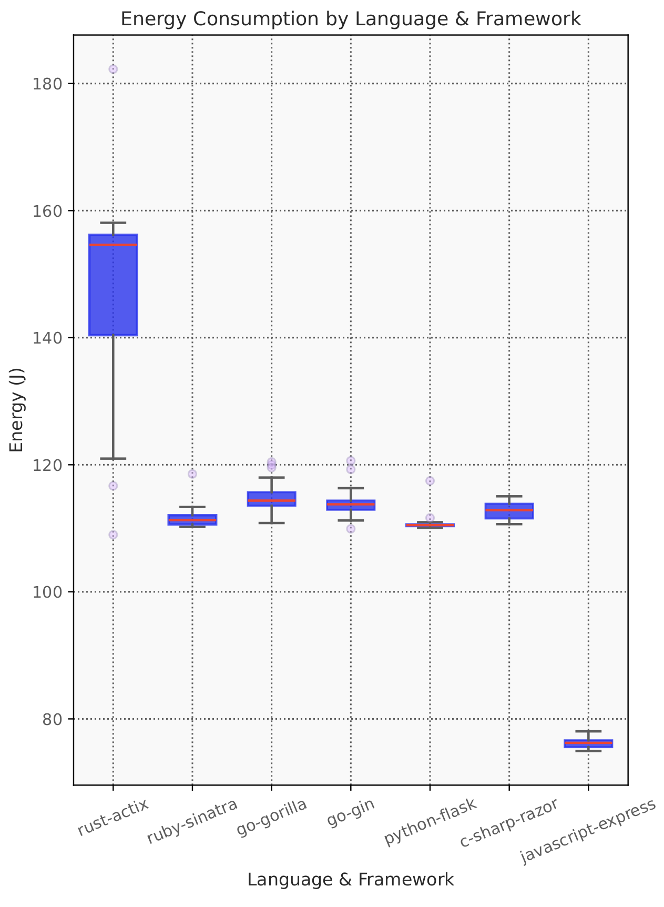
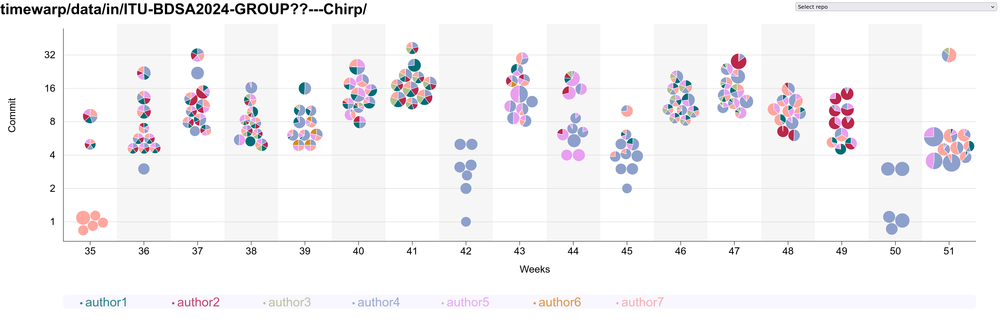
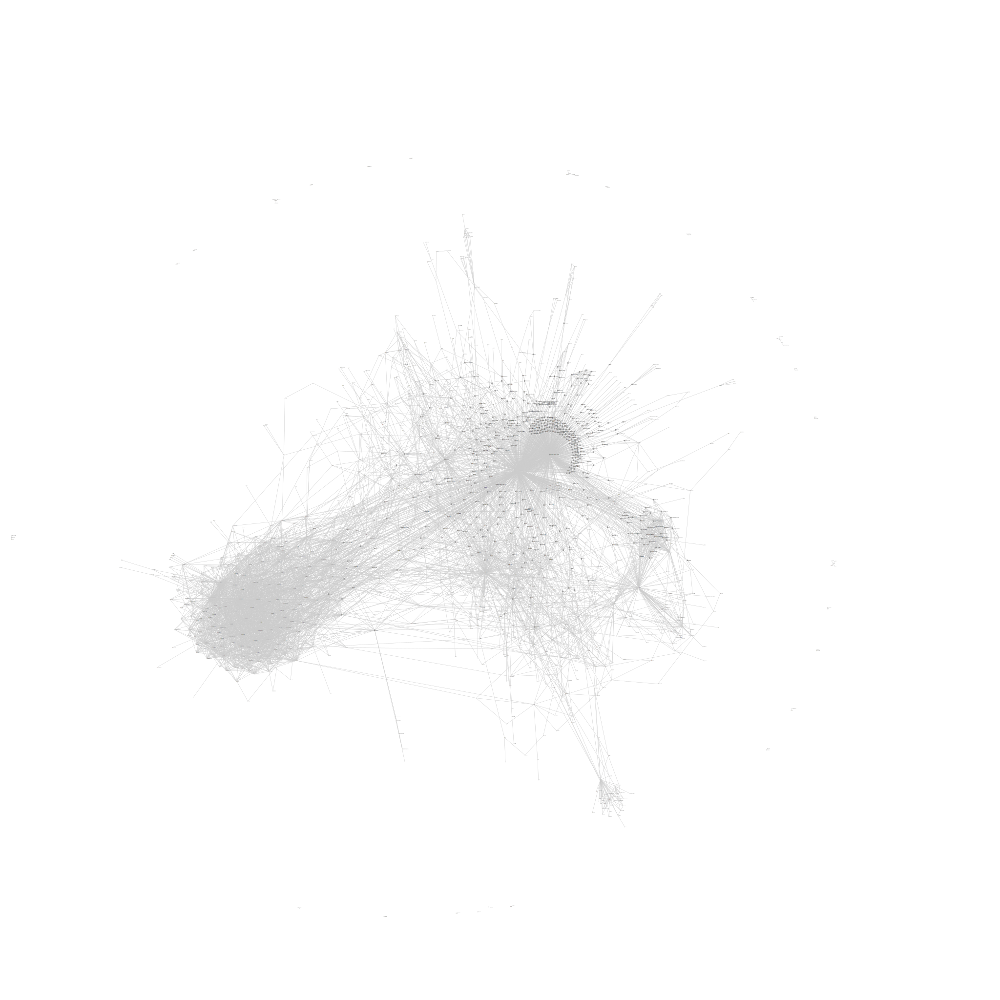

class: center, middle


# DevOps, Software Evolution and Software Maintenance

Helge Pfeiffer, Associate Professor,<br>
[Research Center for Government IT](https://www.itu.dk/forskning/institutter/institut-for-datalogi/forskningscenter-for-offentlig-it),<br>
[IT University of Copenhagen, Denmark](https://www.itu.dk)<br>
`ropf@itu.dk`


---

class: center, middle

# Evaluation

---

### Evaluation

As announced in class, the course is almost over, so it is time for evaluating it.

We run an evaluation that should be really easy and should consume only a few minutes of your time.
The purpose of the evaluation is to provide feedback so that Mircea and I can improve the course next year.

We would like to ask you to provide up to three negative and up to three positive comments about the course. You can do that here: http://138.68.66.124:8888

Please note, the kind of evaluation we are running mimics a public paper-based process.
That is, all information that you enter as feedback will be read by Mircea and me, i.e., it is public information.
Please provide your feedback latest by Tuesday (May 14th) 12:00.

Thank you in advance.

---


---

### ITU-wide Evaluation

Please participate in the ITU-wide evaluation on LearnIT.
Three years ago, the response rate for this course on LearnIT was 0%, which is unpractical since ITUs management mainly looks at these evaluation results:

  * BSc: https://learnit.itu.dk/mod/questionnaire/view.php?id=225465
  * MSc: I believe it is the same link as above, isn't it?

---

class: center, middle

# Exam Preparation

---

### Exam Preparation

  * You can find a bit deeper description of the exam and how it is conducted [here](https://github.com/itu-devops/lecture_notes/blob/master/exam_details.md).
  * See exam description on LearnIT ([BSc](https://learnit.itu.dk/local/coursebase/view.php?ciid=1618)/[MSc](https://learnit.itu.dk/local/coursebase/view.php?ciid=1620)) under section _Ordinary exam_
  * The course and exam are based on your project. However, the entire curriculum is relevant for the exam.


--

  * Please let us know in good time before the exam if you have any special conditions that lead to that you have longer exam times so that we can schedule accordingly.

---

#### "I want to have the exam on day ..."

  * We cannot promise that the exams can be scheduled so that everybody is 100% happy with its placement.
  * But you can help us scheduling by indicating your preferred days and days you would like to avoid in the [shared spreadsheet](https://ituniversity.sharepoint.com/:x:/r/sites/2025DevOpsSoftwareEvolutionandSoftwareMaintenance/Shared%20Documents/General/exam_preferences.xlsx?d=wa73cafcd21464ab6840b0784d4baf0ae&csf=1&web=1&e=anuNZb).
  * Once we have feedback from all of you, I will share an exam plan in our Git repository.

Important, when editing the spreadsheet, please make sure that the number of group members is still correct. If not please update it and inform us about it (by sending a message in the Teams channel to us).

---

class: center, middle

# [Why do all good things come to an end?](https://youtu.be/4pBo-GL9SRg?t=41)

---

### The Simulator stops now!

```bash
pkill -f minitwit_simulator
```

---

### Lean back, relax a bit, and be proud of yourselves


---

### Release Activity

<object width="100%" data="http://138.68.66.124/release_activity_weekly.svg"></object>

---

### Weekly Commit Activity

<object width="100%" data="http://138.68.66.124/commit_activity_weekly.svg"></object>

---

### Daily Commit Activity

<object width="100%" data="http://138.68.66.124/commit_activity_daily.svg"></object>

---

### Latest processed events

<object width="100%" data="http://206.81.20.113/chart.svg"></object>

---

class: center, middle

# Work with us?!


---

### Teaching Assistants for this course in 2026

From earlier evaluations:

  > * Great TA's! They were helpful many times for answering questions.
  > * [...] TAs are really good at presenting relevant stuff [...]!

---

### Teaching Assistants for this course in 2026

Typical Tasks:

  * Operate the Simulator
  * Talk to and help student groups
  * Implement improvements in the teaching material and/or the course's technical infrastructure
  * Interact with Mircea and Helge to point out recurring issues and problems from student groups

---

#### Teaching Assistant for BDSA Fall 2026


Is a course with focus on a project, a Twitter-clone in C#/.Net called Chirp.

Tasks:

  * Help prepare lecture and preparation material
  * Providing feedback and guidance to student groups
  * 15ECTS course, i.e., many paid hours of work 😀

---

class: center, middle

# Thesis/Project Topics

---

### Mircea

Project ideas: go to [mircealungu.com](https://mircealungu.com/) and scroll to the *Student Projects* section. Follow the link for [*student projects on GitHub*](https://github.com/mircealungu/student-projects/).


---

### Helge

---

#### What I do not want to supervise as projects next year

  * _"We want to do something with Kubernetes"_
  * _"We want to implement a certain DevOps CI pipeline"_
  * In essence, theses related to the topics of this course 😀
    - Only exception, in case you are working with a company and you plan to evaluate and measure quality in-/decrease by working in a certain way.

--

#### What I would like to supervise

  * Projects on software quality, software quality assessments
  * Tools implementing software quality metrics
  * Mining (VCS, issue trackers, etc.) studies
  * Projects on the following three examples


  * Group projects (3 to 4 students)
  * Importantly, you are **motivated**
  * I will be on paternity in fall... The best is to contact me **in person** in case you are interested.

---

#### Example: Energy Consumption of Software 2024 (BSc/MSc)

E.S. Trindade, G. Meding, S. Harwick _"Energy Consumption in Web Applications: A Comparative Analysis of Languages, Frameworks, and Related Technologies"_

 

Possible projects:

  - Energy consumption of database
  - Energy consumption of network calls

---

#### Example: RepoPie – Visualization of VCS (BSc/MSc)

A. Bagge-Kjær, C. Sønderborg, J. Klompmaker, S. Schalls _"Visualization of VCS histories over time"_



Possible projects:

  - Further development of tool and visualization
  - Scientific evaluation of usefulness of visualization

---

#### Example: [DaSEA](https://github.com/DaSEA-project/DASEA) – A Dataset for Software Ecosystem Analysis (BSc/MSc)

P. Buchkova, J.H. Hinnerskov, K. Olsen, H. Pfeiffer [_"DaSEA – A Dataset for Software Ecosystem Analysis"_](https://itu.dk/~ropf/blog/assets/msr2022.pdf)



Possible projects:

  - Add more miners, especially for other operating systems (APT, Gentoo's portage, RPM, ...)
  - Improve long-running miners of large ecosystems like Maven (Maven Central), .Net (NuGet), etc.
  - Improve operating system miners
  - Update and operationalize mining
  - Execute studies with the dataset

---

